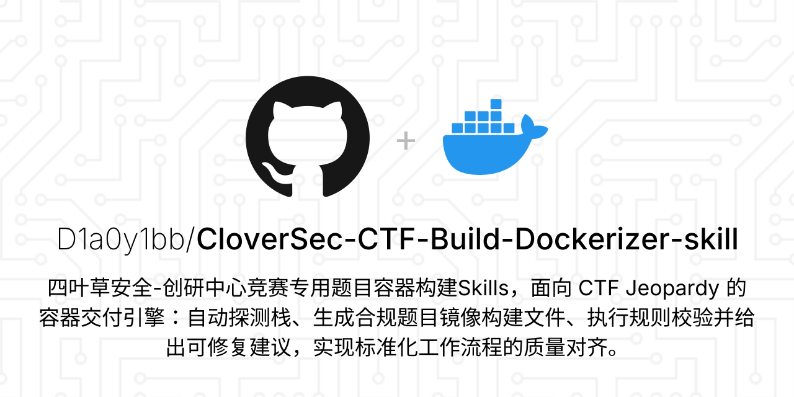

# CloverSec-CTF-Build-Dockerizer

<p align="center">
  <a href="README.md"><strong>简体中文（デフォルト）</strong></a>
  <span> · </span>
  <a href="README.en.md"><strong>English</strong></a>
  <span> · </span>
  <a href="README.ja.md"><strong>日本語</strong></a>

</p>

<p align="center">
  
</p>

<p align="center">
  <a href="https://github.com/D1a0y1bb/CloverSec-CTF-Build-Dockerizer-skill/releases"></a>
  <a href="https://github.com/D1a0y1bb/CloverSec-CTF-Build-Dockerizer-skill"></a>
  <a href="https://github.com/D1a0y1bb/CloverSec-CTF-Build-Dockerizer-skill"></a>
  <a href="https://github.com/D1a0y1bb/CloverSec-CTF-Build-Dockerizer-skill/releases/tag/v2.0.3-r1"></a>
</p>

<p align="center"><code><strong>VERSION</strong>: v2.0.3-r1</code></p>

CloverSec-CTF-Build-Dockerizer は、CloverSec 研究開発センターの CTF 問題コンテナ配布 Skill です。目的は「Dockerfile を作ること」ではなく、CTF 配布作業を再現可能なエンジニアリングフローへ標準化することです。

大会直前に `start.sh` を場当たり修正したり、パッケージ後に契約違反が見つかった経験があるなら、この README をそのまま運用手順として使えます。インストール、提案確認、単一問題レンダリング、シナリオ編成、回帰検証、リリース公開まで一連で実行できます。

## v2.0.3 更新ハイライト

### v1.5.0：ガバナンス基線とランタイム互換

`v1.5.0` では保守性を重視した基盤を整備しました。

- Python 主導のガバナンススクリプト群を整備：`doc_guard.py`、`release_build.py`、`generate_sbom.py`、`sync.py`、`publish_guard.py`。
- `runtime_profiles.yaml` を導入し、`derive_config.py` が runtime 候補と根拠を出力。
- プラットフォーム契約ドキュメントと実装挙動を整合。

### v2.0.0：能力面の本格拡張

`v2.0.0` は V2 アーキテクチャへの移行点です。

- 主入力を `challenge.profile + challenge.defense` に統一し、`challenge.rdg` は互換入力として維持。
- ハード契約を強化し、常に `Dockerfile + start.sh + changeflag.sh` を出力。
- 新スタック `stack=secops`、`stack=baseunit` を追加。
- `render_component.py`、`render_scenario.py`、`validate_scenario.py` を追加。
- AWDP 固定パッチ契約 `patch/src/ + patch/patch.sh + patch_bundle.tar.gz` を実装。

### v2.0.1：収束パッチと再現性向上

`v2.0.1` は最終収束を目的に実施しました。

- `scenario-vulhub-like-basic` を追加し、Vulhub-like 移行例を補完。
- `stacks.yaml` 重複定義を解消し、重複 ID を即時エラー化。
- AWDP パッチバンドルを決定的生成に変更し、不要な差分を削減。

### v2.0.3：中国語デフォルト化とドキュメント全面強化

`v2.0.3` は実行時挙動を変えず、運用文書の品質を大幅に強化します。

- `README.md` を中国語デフォルト完全版に変更。
- `README.en.md` と `README.ja.md` を完全等価の実運用マニュアルへ拡張。
- AI Coding 実践章を追加（Codex、Cursor、Trae、Claude Code、Copilot Chat、Aider）。
- モード別構築手順（Jeopardy / RDG / AWD / AWDP / SecOps / BaseUnit / Vulhub-like）を追加。
- ファイル単位ディレクトリ索引、FAQ、トラブルシュート、リリースチェックリストを追加。
- 外部「参考資料」章を廃止し、リポジトリ内ナビゲーションを中心化。

## コア機能マトリクス

| 機能 | エントリスクリプト | 目的 | 出力 |
|---|---|---|---|
| 自動提案 | `src/CloverSec-CTF-Build-Dockerizer/scripts/derive_config.py` | スタック/ポート/起動/runtime/profile を推定 | `config_proposal` |
| 提案解析 | `src/CloverSec-CTF-Build-Dockerizer/scripts/parse_config_block.py` | `CONFIG PROPOSAL` を `challenge.yaml` 化 | 正規化設定 |
| 単体レンダリング | `src/CloverSec-CTF-Build-Dockerizer/scripts/render.py` | 単一問題の配布物生成 | `Dockerfile/start.sh/changeflag.sh/(flag optional)` |
| 契約検証 | `src/CloverSec-CTF-Build-Dockerizer/scripts/validate.sh` | ハード契約とポリシー検査 | `ERROR/WARN/INFO` |
| コンポーネント生成 | `src/CloverSec-CTF-Build-Dockerizer/scripts/render_component.py` | component+variant 最小単位化 | build 可能なサービスディレクトリ |
| シナリオ生成 | `src/CloverSec-CTF-Build-Dockerizer/scripts/render_scenario.py` | ローカル複数サービス編成を生成 | service dir + `docker-compose.yml` |
| シナリオ検証 | `src/CloverSec-CTF-Build-Dockerizer/scripts/validate_scenario.py` | mode/profile/port/AWDP 契約検査 | pass/fail |
| 例回帰 | `src/CloverSec-CTF-Build-Dockerizer/scripts/validate_examples.sh` | examples/scenario 一括回帰 | 集計レポート |
| スモークテスト | `src/CloverSec-CTF-Build-Dockerizer/scripts/smoke_test.sh` | build レベルの高速回帰 | pass/fail |
| リリース梱包 | `scripts/release_build.sh` / `scripts/publish_release.sh` | アセット生成と公開 | zip/sbom/deps |

## ワンコマンド導入と Skill 検出

まず Skill 検出を確認し、その後インストールします。

```bash
npx -y skills add . --list

npx -y skills add \
  https://github.com/D1a0y1bb/CloverSec-CTF-Build-Dockerizer-skill \
  --skill cloversec-ctf-build-dockerizer \
  --agent codex -y
```

導入後は examples を 1 本通しで実行し、Docker とスクリプト依存がローカルで正常か確認してください。

### Codex UI 表示戦略

Codex UI における Skill カードの表示内容は `src/CloverSec-CTF-Build-Dockerizer/agents/openai.yaml` で制御します。主に次の項目を定義します。

- `display_name`：UI 上のカードタイトル
- `short_description`：タイトル下のサブ説明
- `brand_color`：カードのブランドカラー
- `default_prompt`：試用・起動時に入る既定プロンプト
- `allow_implicit_invocation`：条件一致時にモデルが暗黙起動できるか

現在の既定プロンプト戦略は、先に技術スタックと `profile` を自動検出し、その後に準拠した `Dockerfile` / `start.sh` / `changeflag.sh` を生成し、最後に `validate` と配布ガイダンスを実行するという流れです。この層は Codex UI での見え方と起動方法だけに影響し、`render.py`、`validate.sh`、`render_component.py`、`render_scenario.py` の実行時挙動は変えません。

後で Codex 上のカード名、短い説明、試用プロンプトを調整したい場合は、README 本文より先にこのファイルを編集してください。

```yaml
interface:
  display_name: "CloverSec CTF Build Dockerizer"
  short_description: "标准化题目容器交付、BaseUnit 构建与 Scenario 编排"
  default_prompt: "Use $cloversec-ctf-build-dockerizer to处理当前题目目录，先自动探测技术栈与 profile，再生成合规的 Dockerfile/start.sh/changeflag.sh，并执行 validate 与交付建议。"
```

## クイックスタート

### Agent-Orchestrated フロー（推奨）

標準プロンプト：

```text
CloverSec-CTF-Build-Dockerizer を使って現在の問題ディレクトリを処理してください。
derive_config による CONFIG PROPOSAL（根拠付き）を先に出し、
私が OK したら Dockerfile/start.sh/changeflag.sh 生成と validate を実行してください。
```

ショートプロンプト：

```text
この src は CTF 問題のソースです。プラットフォーム契約準拠の配布物を作ってください。
```

### 手動コマンドチェーン

```bash
python3 src/CloverSec-CTF-Build-Dockerizer/scripts/derive_config.py --project-dir . --format json --pretty
python3 src/CloverSec-CTF-Build-Dockerizer/scripts/render.py --config challenge.yaml --output .
bash src/CloverSec-CTF-Build-Dockerizer/scripts/validate.sh Dockerfile start.sh challenge.yaml
```

### ランタイムプロファイル選択（PHP/Node/Java）

```bash
python3 src/CloverSec-CTF-Build-Dockerizer/scripts/render.py \
  --config challenge.yaml \
  --runtime-profile php74-apache \
  --output .
```

イメージ優先順位：`--base-image > --runtime-profile > challenge.base_image > infer/default`。

## AI コーディング実践ガイド

各ツールごとに「呼び出し方」「推奨プロンプト」「再試行プロンプト」「検収コマンド」を統一形式で示します。

### Codex

呼び出し方：リポジトリルートで「提案 -> 確認 -> レンダリング -> 検証」の順序を明示。

推奨プロンプト：

```text
現在のディレクトリを CloverSec-CTF-Build-Dockerizer で処理してください。
まず derive_config.py を実行して evidence 付き CONFIG PROPOSAL を出力。
私の確認後に render + validate + smoke を実行し、失敗修正を報告してください。
対象モード: <jeopardy|rdg|awd|awdp|secops|baseunit|scenario>
```

再試行プロンプト：

```text
全体をやり直さず、現行 ERROR の最小修正のみ実施してください。
必要最小限の再検証だけ実行し、変更ファイルと結果を報告してください。
```

検収コマンド：

```bash
bash scripts/doc_guard.sh
bash src/CloverSec-CTF-Build-Dockerizer/scripts/validate_examples.sh
```

### Cursor

呼び出し方：編集前に `challenge.yaml` / `scenario.yaml` を読ませる。

推奨プロンプト：

```text
既存スクリプト（render.py/validate.sh）を必ず利用し、手書き置換をしないでください。
CONFIG PROPOSAL を先に提示し、OK 後にレンダリングへ進んでください。
最終的に Dockerfile/start.sh/changeflag.sh 契約を満たしてください。
```

再試行プロンプト：

```text
通過済み部分は変更せず、今回失敗分のみ修正してください。
再検証コマンドをそのまま貼れる形で提示してください。
```

検収コマンド：

```bash
bash src/CloverSec-CTF-Build-Dockerizer/scripts/smoke_test.sh
```

### Trae

呼び出し方：4 段階（提案確認 -> レンダリング -> 検証 -> 振り返り）を固定。

推奨プロンプト：

```text
あなたは配布エンジニアです。
Phase1: derive_config と evidence を提示。
Phase2: 私の確認後に render 実行。
Phase3: validate/smoke 実行。
Phase4: 残リスクとリリース前確認項目を提示。
```

再試行プロンプト：

```text
失敗を「設定」「テンプレート」「実行時」に分類し、
1分類ずつ修正して即時再検証してください。
```

検収コマンド：

```bash
npx -y skills add . --list
bash scripts/release_build.sh
```

### Claude Code

呼び出し方：計画、実装、コマンド結果要約を明示要求。

推奨プロンプト：

```text
このリポジトリで V2 配布フローを実行してください:
1) derive_config -> CONFIG PROPOSAL
2) render.py / render_component.py / render_scenario.py（モードに応じて）
3) validate.sh / validate_scenario.py / smoke_test.sh
4) 失敗原因、修正内容、残リスクを要約
```

再試行プロンプト：

```text
通過済み手順は無視し、最新失敗コマンドに集中してください。
根因説明の後、最小パッチを適用して再検証してください。
```

検収コマンド：

```bash
bash scripts/doc_guard.sh
bash src/CloverSec-CTF-Build-Dockerizer/scripts/validate_examples.sh
bash src/CloverSec-CTF-Build-Dockerizer/scripts/smoke_test.sh
```

### GitHub Copilot Chat

呼び出し方：VS Code 上で「既存スクリプト限定」を最初に固定。

推奨プロンプト：

```text
このリポジトリの既存スクリプト（derive_config/render/validate）のみで実行してください。
Dockerfile を一から書き直さないでください。
先に CONFIG PROPOSAL を提示し、確認後に次工程へ進んでください。
```

再試行プロンプト：

```text
端末エラーごとに該当ファイル/行を示し、
影響範囲のみ修正して再検証してください。
```

検収コマンド：

```bash
bash scripts/release_build.sh
```

### Aider

呼び出し方：先に失敗ログを作り、そのログをもとに限定修正。

推奨プロンプト：

```text
次の失敗ログをもとに修正してください。
目標チェック:
- bash scripts/doc_guard.sh
- bash src/CloverSec-CTF-Build-Dockerizer/scripts/validate_examples.sh
大規模リファクタは禁止、既存構成を維持してください。
```

再試行プロンプト：

```text
パッチ範囲が広すぎます。最小変更戦略に切り替えてください。
現在の失敗と直接関係するファイルだけを修正し、
各変更がどのエラーを解消するか対応付けて説明してください。
```

検収コマンド：

```bash
git diff --stat
bash scripts/doc_guard.sh
```

## 競技モード構築ガイド

### Jeopardy（Web / Pwn / AI）

通常の解題型配布。既定 profile は `jeopardy`。

```bash
python3 src/CloverSec-CTF-Build-Dockerizer/scripts/render.py \
  --config src/CloverSec-CTF-Build-Dockerizer/examples/node-basic/challenge.yaml \
  --output /tmp/jeopardy-node

bash src/CloverSec-CTF-Build-Dockerizer/scripts/validate.sh \
  /tmp/jeopardy-node/Dockerfile \
  /tmp/jeopardy-node/start.sh \
  /tmp/jeopardy-node/challenge.yaml
```

### RDG

防御運用 + check_service 方式向け。通常 `stack=rdg` を使用。

```bash
python3 src/CloverSec-CTF-Build-Dockerizer/scripts/render.py \
  --config src/CloverSec-CTF-Build-Dockerizer/examples/rdg-python-ssti-basic/challenge.yaml \
  --output /tmp/rdg-python

bash src/CloverSec-CTF-Build-Dockerizer/scripts/validate.sh \
  /tmp/rdg-python/Dockerfile \
  /tmp/rdg-python/start.sh \
  /tmp/rdg-python/challenge.yaml
```

### AWD

攻防戦向け。既存 stack に `profile=awd` を重ねて実装。

重要：本プロジェクトは `stack=awd` を新設しません。

```bash
python3 src/CloverSec-CTF-Build-Dockerizer/scripts/render_scenario.py \
  --config src/CloverSec-CTF-Build-Dockerizer/examples/scenario-awd-basic/scenario.yaml \
  --output /tmp/scenario-awd

python3 src/CloverSec-CTF-Build-Dockerizer/scripts/validate_scenario.py \
  --output /tmp/scenario-awd
```

### AWDP

attack + fix 向け。直接 SSH 修正ではなく、パッチバンドル提出方式。

固定契約：

- `patch/src/`
- `patch/patch.sh`
- `patch_bundle.tar.gz`

```bash
python3 src/CloverSec-CTF-Build-Dockerizer/scripts/render.py \
  --config src/CloverSec-CTF-Build-Dockerizer/examples/node-awdp-basic/challenge.yaml \
  --output /tmp/awdp-node

bash src/CloverSec-CTF-Build-Dockerizer/scripts/validate.sh \
  /tmp/awdp-node/Dockerfile \
  /tmp/awdp-node/start.sh \
  /tmp/awdp-node/challenge.yaml
```

### SecOps

セキュリティ運用・ハードニング課題向け。

重要：`stack=secops + profile=secops` は RDG 流用ではなく独立モデル。

```bash
python3 src/CloverSec-CTF-Build-Dockerizer/scripts/render.py \
  --config src/CloverSec-CTF-Build-Dockerizer/examples/secops-nginx-basic/challenge.yaml \
  --output /tmp/secops-nginx

bash src/CloverSec-CTF-Build-Dockerizer/scripts/validate.sh \
  /tmp/secops-nginx/Dockerfile \
  /tmp/secops-nginx/start.sh \
  /tmp/secops-nginx/challenge.yaml
```

### BaseUnit（指定バージョンサービス最小単位）

特定サービス/バージョンを短時間で配布可能な基座として生成する用途。

初期 10 コンポーネント：`mysql`、`redis`、`sshd`、`ttyd`、`apache`、`nginx`、`tomcat`、`php-fpm`、`vsftpd`、`weblogic`。

```bash
python3 src/CloverSec-CTF-Build-Dockerizer/scripts/render_component.py --list

python3 src/CloverSec-CTF-Build-Dockerizer/scripts/render_component.py \
  --component redis \
  --variant 7.2-alpine \
  --profile jeopardy \
  --output /tmp/baseunit-redis

bash src/CloverSec-CTF-Build-Dockerizer/scripts/validate.sh \
  /tmp/baseunit-redis/Dockerfile \
  /tmp/baseunit-redis/start.sh \
  /tmp/baseunit-redis/challenge.yaml
```

### Vulhub-like 移行

Vulhub 風の複数サービス環境を「ローカル compose 編成 + 単一サービス納品」へ移行する手順。

境界：`docker-compose.yml` はローカル検証専用。最終納品は各サービス単位。

```bash
python3 src/CloverSec-CTF-Build-Dockerizer/scripts/render_scenario.py \
  --config src/CloverSec-CTF-Build-Dockerizer/examples/scenario-vulhub-like-basic/scenario.yaml \
  --output /tmp/scenario-vulhub-like

python3 src/CloverSec-CTF-Build-Dockerizer/scripts/validate_scenario.py \
  --output /tmp/scenario-vulhub-like
```

## プラットフォーム硬契約と境界

すべてのレンダリング結果で以下が必須です。

- `Dockerfile` が存在。
- 実行可能な `start.sh` が存在。
- 実行可能な `changeflag.sh` が存在。
- イメージ内に `/bin/bash` が存在。
- Dockerfile に `EXPOSE` 宣言がある。
- `start.sh` は実サービスを起動し、空回し keepalive を使わない。

`flag` ルール：

- 既定では `flag` 必須。
- `include_flag_artifact=false` 指定時に限り `flag` 欠落のみ許可。
- `changeflag.sh` 欠落は常に不可。

Scenario 境界：

- `docker-compose.yml` はローカル編成検証で利用可能。
- プラットフォーム最終納品は引き続き単一サービスディレクトリ（`Dockerfile + start.sh + changeflag.sh`）。

## Workflow スクリーンショット（プロンプトから公開まで）

Prompt 入力：


提案確認：


エラー収束：


自動生成：


自動検証：


硬契約チェック：


配布チェックリスト：


## Build_test 実例

`Build_test/` は、実際の問題ケースを再現可能な build/validate フローで管理するためのディレクトリです。

| ディレクトリ | スタック | ポート | 起動コマンド | 主要ファイル |
|---|---|---:|---|---|
| `Build_test/CTF-NodeJs RCE-Test1` | node | 3000 | `node app.js` | `challenge.yaml` `Dockerfile` `start.sh` `app.js` |
| `Build_test/CTF-Python沙箱逃逸-Test2` | python | 5000 | `python app.py` | `challenge.yaml` `Dockerfile` `start.sh` `Build_test/CTF-Python沙箱逃逸-Test2/src/app.py` |

再検証コマンド：

```bash
cd "Build_test/CTF-NodeJs RCE-Test1"
npm ci
bash ../../src/CloverSec-CTF-Build-Dockerizer/scripts/validate.sh Dockerfile start.sh challenge.yaml

cd "../CTF-Python沙箱逃逸-Test2"
bash ../../src/CloverSec-CTF-Build-Dockerizer/scripts/validate.sh Dockerfile start.sh challenge.yaml
```

## ファイル単位ディレクトリ索引

### ルート

| ファイル/ディレクトリ | 役割 |
|---|---|
| `README.md` | 中国語完全マニュアル（既定入口） |
| `README.en.md` | 英語完全マニュアル |
| `README.ja.md` | 日本語完全マニュアル |
| `VERSION` | 現在バージョン |
| `CHANGELOG.md` | 変更履歴 |
| `LICENSE` | ライセンス |
| `Build_test/` | 実例回帰ケース |
| `dist/` | リリース生成アセット |

### `scripts/`

| ファイル | 役割 |
|---|---|
| `scripts/doc_guard.py` | 文書整合性ゲート本体 |
| `scripts/doc_guard.sh` | doc guard エントリ |
| `scripts/release_build.py` | リリース梱包本体 |
| `scripts/release_build.sh` | 梱包エントリ |
| `scripts/publish_guard.py` | 公開前 version/白名单ガード |
| `scripts/publish_release.sh` | commit + push + tag + release 編成 |
| `scripts/generate_sbom.py` | SBOM 生成本体 |
| `scripts/generate_sbom.sh` | SBOM エントリ |
| `scripts/sync.py` | ソース同期ロジック |
| `scripts/sync.sh` | 同期エントリ |

### `src/CloverSec-CTF-Build-Dockerizer/data`

| ファイル | 役割 |
|---|---|
| `schema.md` | `challenge.yaml` 契約 |
| `scenario_schema.md` | `scenario.yaml` 契約 |
| `stacks.yaml` | スタック既定値 |
| `profiles.yaml` | profile 既定挙動 |
| `components.yaml` | BaseUnit component + variant 定義 |
| `runtime_profiles.yaml` | ランタイムプロファイル定義 |
| `patterns.yaml` | 自動検出ルール |
| `validate_rules.yaml` | `validate.sh` ルール |
| `validate_scenario_rules.yaml` | `validate_scenario.py` ルール |
| `base_image_allowlist.yaml` | 基底イメージ許可リスト |
| `README.md` | data 説明 |

### `src/CloverSec-CTF-Build-Dockerizer/scripts`

| ファイル | 役割 |
|---|---|
| `derive_config.py` | 提案生成 |
| `parse_config_block.py` | 提案解析 |
| `render.py` | 単体レンダリング |
| `render_component.py` | BaseUnit レンダリング |
| `render_scenario.py` | シナリオレンダリング |
| `validate.sh` | 単体契約検証 |
| `validate_scenario.py` | シナリオ契約検証 |
| `validate_examples.sh` | 例一括回帰 |
| `smoke_test.sh` | スモーク回帰 |
| `validate_context.py` | challenge 文脈解析補助 |
| `autofix.py` | 自動修正補助 |
| `detect_stack.py` | スタック検出補助 |
| `utils.py` | 共通ユーティリティ |
| `cleanup_test_containers.sh` | テストコンテナ掃除 |
| `test_runtime_profiles.sh` | runtime profile 回帰 |
| `README.md` | scripts 説明 |

### `src/CloverSec-CTF-Build-Dockerizer/templates`

| パス | 役割 |
|---|---|
| `templates/node|php|python|java|tomcat|lamp|pwn|ai/` | Jeopardy テンプレート |
| `templates/rdg/` | RDG 専用テンプレート |
| `templates/secops/` | SecOps 専用テンプレート |
| `templates/baseunit/` | BaseUnit 共通テンプレート |
| `templates/snippets/` | defense/check/changeflag 断片 |
| `templates/README.md` | templates 説明 |

### `src/CloverSec-CTF-Build-Dockerizer/examples`

| パス | 役割 |
|---|---|
| `examples/*-basic` | 単一問題の最小例 |
| `examples/node-awdp-basic` | AWDP 単体契約例 |
| `examples/secops-*-basic` | SecOps 例 |
| `examples/baseunit-*` | BaseUnit 例 |
| `examples/scenario-awd-basic` | AWD scenario 例 |
| `examples/scenario-awdp-basic` | AWDP scenario 例 |
| `examples/scenario-vulhub-like-basic` | Vulhub-like 移行例 |
| `examples/README.md` | examples 説明 |

### `src/CloverSec-CTF-Build-Dockerizer/docs`

| ファイル | 役割 |
|---|---|
| `architecture_overview.md` | アーキテクチャ概要 |
| `platform_contract.md` | プラットフォーム契約 |
| `stack_cookbook.md` | スタック構築手引き |
| `directory_guide.md` | ディレクトリ設計説明 |
| `troubleshooting.md` | 障害対応手引き |
| `beginner_guide.md` | 初学者向けガイド |

## FAQ とトラブルシュート

### Q1：なぜ `/start.sh`、`/changeflag.sh`、`/bin/bash` が必須ですか？

これはプラットフォーム実行契約です。いずれか欠けると起動やリセットが破綻します。

### Q2：`include_flag_artifact=false` を指定したのにエラーになります。

緩和されるのは `flag` のみです。`changeflag.sh` の欠落は許可されません。

### Q3：AWD と SecOps の使い分けは？

- 攻防運用主体なら「既存 stack + `profile=awd`」。
- 加固運用主体なら `stack=secops + profile=secops`。

### Q4：AWDP が直接 SSH 修正方式ではない理由は？

AWDP の本質は「パッチ提出と監査」です。`patch/src + patch.sh + tar.gz` を提出し、平台側で自動適用します。

### Q5：Scenario の compose をそのまま最終納品できない理由は？

対象プラットフォームは単一サービス納品前提だからです。compose はローカル検証専用です。

### Q6：`npx -y skills add . --list` は Release 資産に依存しますか？

依存しません。前者は Skill 検出、後者は配布アーカイブです。

## 保守・貢献・リリース

リリース前の最小チェック：

```bash
bash scripts/doc_guard.sh
bash src/CloverSec-CTF-Build-Dockerizer/scripts/validate_examples.sh
bash src/CloverSec-CTF-Build-Dockerizer/scripts/smoke_test.sh
npx -y skills add . --list
bash scripts/release_build.sh
```

正式公開：

```bash
bash scripts/publish_release.sh --version v2.0.3-r1
```

リモート tag/release 競合や認証失敗が出た場合は、その時点で停止し、先に阻害要因を解消してください。

## License

本プロジェクトは [MIT License](LICENSE) の下で提供されます。
