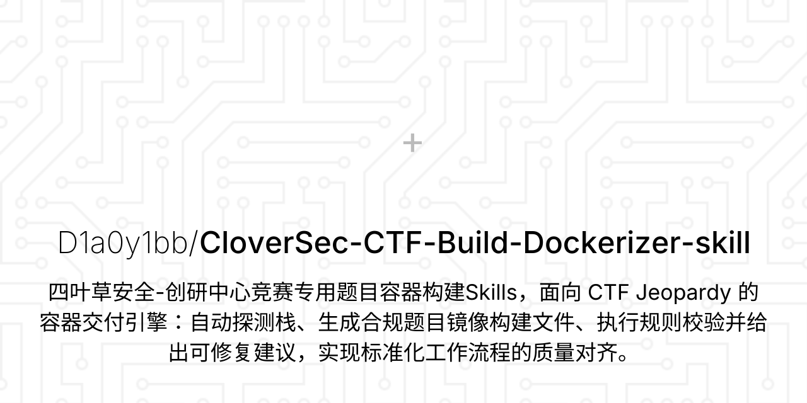
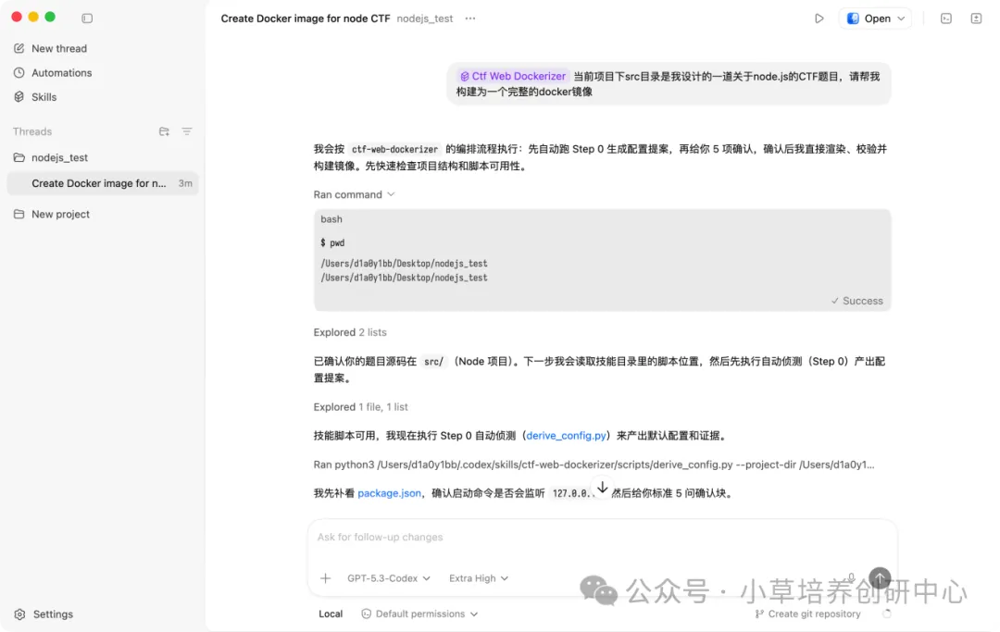
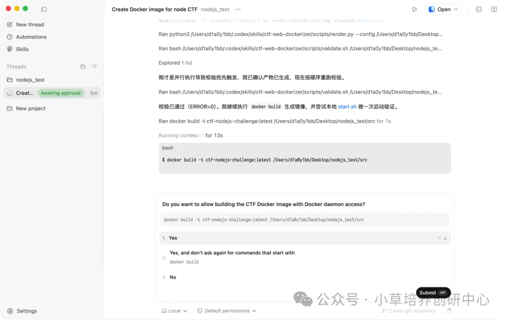
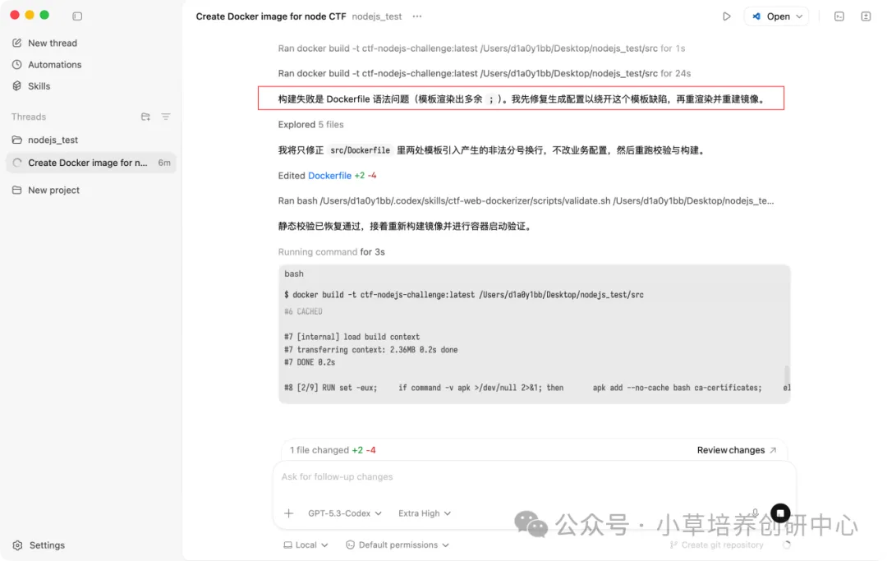
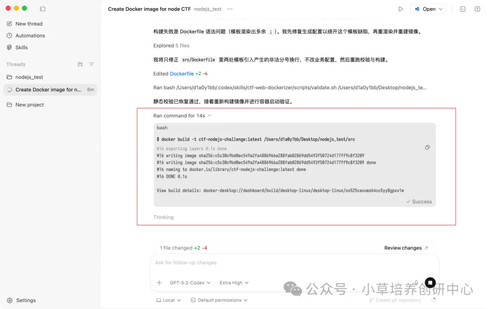
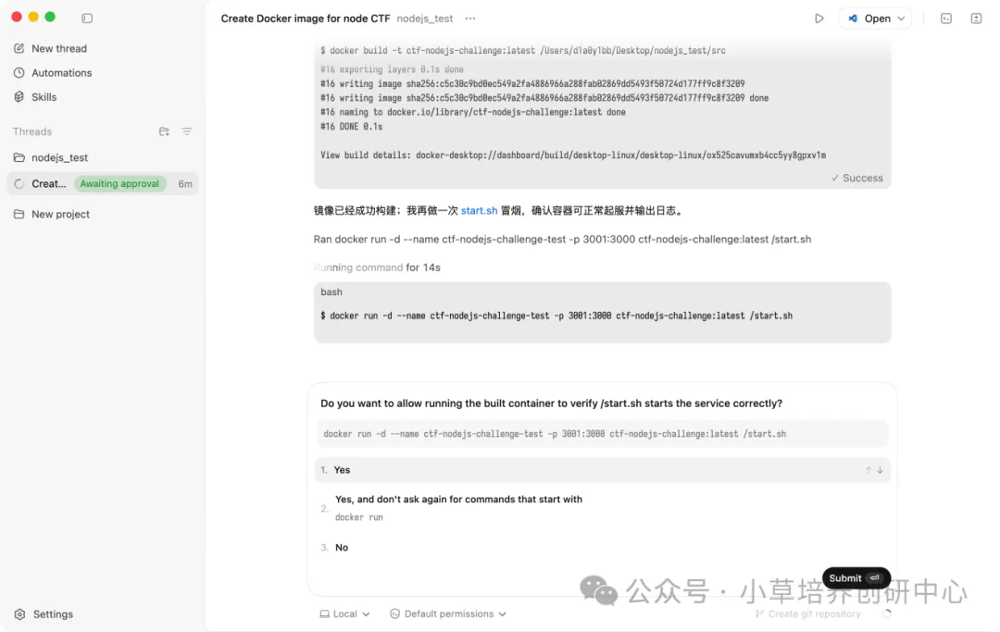
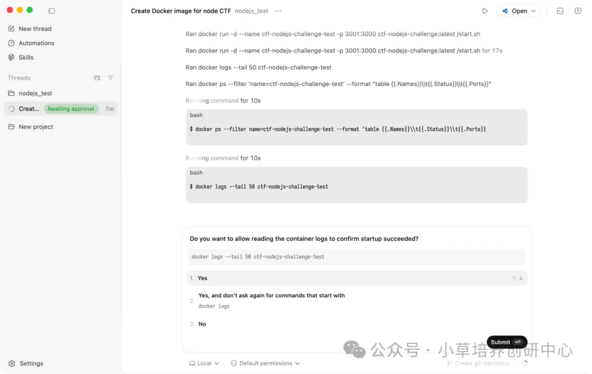
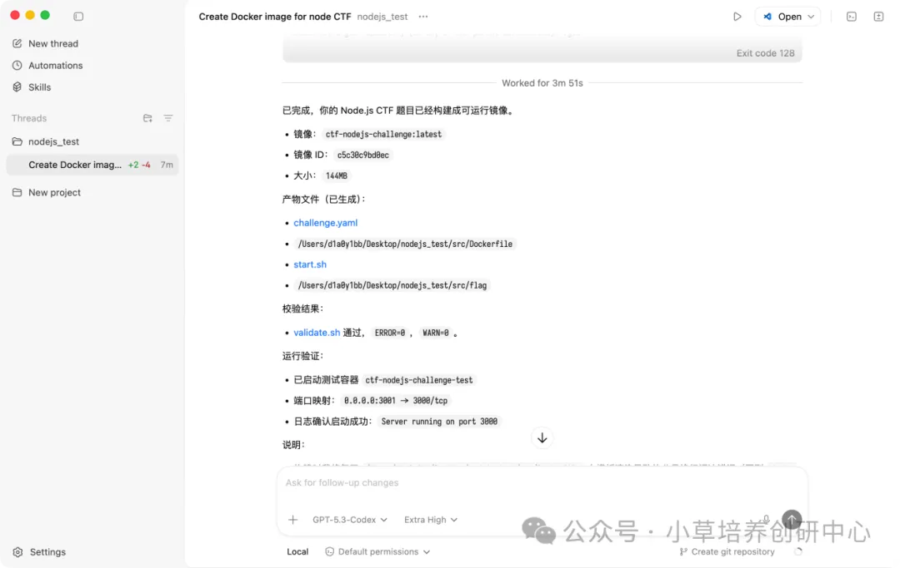

# CloverSec-CTF-Build-Dockerizer

<p align="center">
  <a href="README.md"><strong>简体中文（デフォルト）</strong></a>
  <span> · </span>
  <a href="README.en.md"><strong>English</strong></a>
  <span> · </span>
  <a href="README.ja.md"><strong>日本語</strong></a>

</p>

<p align="center">
  
</p>

<p align="center">
  <a href="https://github.com/D1a0y1bb/CloverSec-CTF-Build-Dockerizer-skill/releases"></a>
  <a href="https://github.com/D1a0y1bb/CloverSec-CTF-Build-Dockerizer-skill"></a>
  <a href="https://github.com/D1a0y1bb/CloverSec-CTF-Build-Dockerizer-skill"></a>
  <a href="https://github.com/D1a0y1bb/CloverSec-CTF-Build-Dockerizer-skill/releases/tag/v2.2.0-r6"></a>
</p>

<p align="center"><code><strong>VERSION</strong>: v2.2.0-r6</code></p>

CloverSec-CTF-Build-Dockerizer は、CloverSec 研究開発センターの CTF 問題コンテナ配布 Skill です。目的は「Dockerfile を作ること」ではなく、CTF 配布作業を再現可能なエンジニアリングフローへ標準化することです。

大会直前に `start.sh` を場当たり修正したり、パッケージ後に契約違反が見つかった経験があるなら、この README をそのまま運用手順として使えます。インストール、提案確認、単一問題レンダリング、シナリオ編成、回帰検証、リリース公開まで一連で実行できます。

## v2.2.0-r6 リリース修正

`v2.2.0-r6` は `v2.2.0` の 6 回目のリリース修正版です。`challenge.yaml` contract と通常の単一問題レンダリング挙動は変更しません。実利用の feedback で出た inference boundary、Pwn flag path review、低リスク設定向けの reviewed render path を改善します。

この r6 release の主な修正点：

- `smoke_test.sh` は macOS の `mktemp "...XXXXXX.yaml"` 問題を修正し、生成した `solve_probe` YAML をランダムな一時ディレクトリに書きます。
- `derive_config.py` は `gates` と `manual_required` を一致させます。既存 `challenge.yaml` が stack、ports、start command を明示している場合、対応する gate を解除します。
- `audit_input.py` は explicit config と automatic detection を分離します。`challenge.yaml` の stack を優先し、検出結果は `detected_stack_hint` として扱います。
- Pwn project では source text から `flag0`、`flag1`、`flag.txt`、`/home/ctf/flag*` などを探し、`flag_path_hints` として `challenge.flag.sync_paths` の確認対象にします。
- `workflow.py reviewed-render --reason "..."` は低リスク入力向けの reviewed render path を追加します。mixed/dirty/high_risk input は引き続き proposal/accept が必要です。
- `src/CloverSec-CTF-Build-Dockerizer/docs/solve_probe_recipes.md` に HTTP、TCP、container_exec、Pwn nc、dynamic flag path probe の例を追加しました。

## v2.2.0 主な更新

`v2.2.0` は、数か月にわたる実運用上の問題と Agent ワークフローの改善をまとめた集中アップグレードです。実際の競技問題配布でよく出る、問題ディレクトリが整理されていない、入力ソースが混在している、古いプロジェクトが compose / Vulhub-like 構造を持っている、Linux kernel CVE / LPE 問題を通常の Docker だけでは正しく再現できない、といった課題を重点的に扱います。Skill 入口と context 管理も大きく見直し、同じタスクで読む文脈を減らし、読み込みを速くし、token 消費を抑えます。

この版の内容：

1. 実競技シーンの対応範囲を拡大：Jeopardy、Web、Pwn、AI、RDG、AWD、AWDP、SecOps、BaseUnit、Scenario/Vulhub-like、Bundle/Recipe、Linux-QEMU を対象化。競技プラットフォーム向けの最終成果物は単一サービスの `Dockerfile + start.sh + changeflag.sh` 形式を維持し、複数サービス編成は主にローカル検証、移行、複雑な問題整理に使います。
2. Linux kernel CVE / LPE 専用の配布方式：プラットフォームから見ると 1 つの Docker 成果物ですが、コンテナ内部で QEMU による独立 Linux guest 環境を起動し、指定 kernel、rootfs、問題サービスを載せます。これにより Docker の配布形式を維持しながら、kernel 問題を実際の脆弱環境に近い形で動かせます。
3. 複雑な入力は先に proposal confirmation：mixed input、dirty directory、high-risk input、compose/Vulhub-like project、Linux-QEMU missing assets、cPanel/WHM 系入力は proposal confirmation に入ります。人工確認で進める場合は理由を記録し、text / JSON output に残します。
4. 実プロジェクトに近いサンプル検証：`validate_examples.sh` は既定で read-only、`Build_test/` は expected pass / expected fail を扱える実例プール、Scenario は service ごとの検証、Linux-QEMU は preflight から full validation まで段階的に使えます。
5. Bundle、Compose、service check の拡張：v2.2.0 では Bundle Recipe prototype、compose/Vulhub-like import draft、HTTP/TCP/Redis/MySQL/SSH check-service skeleton を追加しました。
6. リリース前状態を把握しやすく：render、scenario validation、release checks が structured output に対応しました。
7. Progressive disclosure による軽い Skill 入口：`SKILL.md` は 1089 行から 206 行へ減り、約 81.1% 削減。bytes は 39254 から 10204 へ減り、約 74.0% 削減。同じタスクで読む入口文脈を減らし、読み込みを速くしました。

## コア機能マトリクス

| 機能 | エントリスクリプト | 目的 | 出力 |
|---|---|---|---|
| 状態付きワークフロー | `src/CloverSec-CTF-Build-Dockerizer/scripts/workflow.py` | 分析、確認、生成、検証、状態確認を編成 | `.ctfbuild/session.json` |
| 入力監査と提案 | `src/CloverSec-CTF-Build-Dockerizer/scripts/audit_input.py` / `derive_config.py` | スタック、ポート、起動方法、実行環境、profile、リスクを推定 | 監査結果 / 構築案 |
| 構築案解析 | `src/CloverSec-CTF-Build-Dockerizer/scripts/parse_config_block.py` | 確認済みの構築案を `challenge.yaml` 化 | 正規化設定 |
| 単体レンダリング | `src/CloverSec-CTF-Build-Dockerizer/scripts/render.py` | 単一問題の配布物生成 | `Dockerfile/start.sh/changeflag.sh/(flag optional)` |
| 契約検証 | `src/CloverSec-CTF-Build-Dockerizer/scripts/validate.sh` | ハード契約とポリシー検査 | `ERROR/WARN/INFO` / JSON summary |
| コンポーネント生成 | `src/CloverSec-CTF-Build-Dockerizer/scripts/render_component.py` | component+variant 最小単位化 | build 可能なサービスディレクトリ |
| Bundle/Recipe レンダリング | `src/CloverSec-CTF-Build-Dockerizer/scripts/render_bundle.py` / `validate_bundle.py` | 固定 recipe または明示 custom の単一コンテナ複数サービス構成を生成・検証 | プラットフォーム配布ディレクトリ |
| Compose/Vulhub-like import | `src/CloverSec-CTF-Build-Dockerizer/scripts/import_compose.py` | ports、environment、depends_on、networks、healthcheck などの手掛かりを保持し、draft、renderable subset、import report を生成 | `scenario.draft.yaml` / `scenario.renderable.yaml` / `import-report.json` |
| check-service skeleton | `src/CloverSec-CTF-Build-Dockerizer/scripts/generate_check_stub.py` | HTTP/TCP/Redis/MySQL/SSH check 骨格を生成し、status、text、Redis key、MySQL query 断言に対応 | review-required `check/check.sh` |
| Linux-QEMU レンダリング | `src/CloverSec-CTF-Build-Dockerizer/scripts/render.py` | Docker 内 QEMU guest 配布物を生成 | 単一イメージ配布ディレクトリ |
| Linux-QEMU manual validation | `scripts/linux_qemu_manual_check.sh` | preflight/static/build/boot/flag/full 検証 | JSON summary / evidence notes |
| シナリオ生成 | `src/CloverSec-CTF-Build-Dockerizer/scripts/render_scenario.py` | ローカル複数サービス編成を生成 | service dir + `docker-compose.yml` |
| シナリオ検証 | `src/CloverSec-CTF-Build-Dockerizer/scripts/validate_scenario.py` | mode/profile/port/AWDP 契約検査 | pass/fail |
| 例回帰 | `src/CloverSec-CTF-Build-Dockerizer/scripts/validate_examples.sh` | examples/scenario 一括回帰 | 集計レポート |
| スモークテスト | `src/CloverSec-CTF-Build-Dockerizer/scripts/smoke_test.sh` | build レベルの高速回帰 | pass/fail |
| 実例プール回帰 | `scripts/validate_build_test.py` | Build_test cases を expected pass/fail で検証 | structured summary |
| リリース梱包 | `scripts/release_build.sh` / `scripts/publish_release.sh` | アセット生成と公開 | zip/sbom/deps |

## ワンコマンド導入と Skill 検出

まず Skill 検出を確認し、その後インストールします。

```bash
npx -y skills add . --list

npx -y skills add \
  https://github.com/D1a0y1bb/CloverSec-CTF-Build-Dockerizer-skill \
  --skill cloversec-ctf-build-dockerizer \
  --agent codex -y
```

導入後は examples を 1 本通しで実行し、Docker とスクリプト依存がローカルで正常か確認してください。

### Codex UI 表示戦略

Codex UI における Skill カードの表示内容は `src/CloverSec-CTF-Build-Dockerizer/agents/openai.yaml` で制御します。主に次の項目を定義します。

- `display_name`：UI 上のカードタイトル
- `short_description`：タイトル下のサブ説明
- `brand_color`：カードのブランドカラー
- `default_prompt`：試用・起動時に入る既定プロンプト
- `allow_implicit_invocation`：条件一致時にモデルが暗黙起動できるか

現在の既定プロンプト戦略は、まず問題ディレクトリを確認し、証拠、リスク、不足情報を整理して構築案を提示する流れです。ユーザー確認後に Docker 配布物を生成し、検証を実行します。この層は Codex UI での見え方と起動方法だけに影響し、`workflow.py`、`render.py`、`validate.sh`、`render_component.py`、`render_scenario.py` の実行時挙動は変えません。

後で Codex 上のカード名、短い説明、試用プロンプトを調整したい場合は、README 本文より先にこのファイルを編集してください。

```yaml
interface:
  display_name: "CloverSec CTF Build Dockerizer"
  short_description: "将 CTF 题目整理为可验证的 Docker 交付件，支持内核题与多服务场景"
  default_prompt: "<中国語の既定プロンプトは agents/openai.yaml に保存>"
```

## クイックスタート

### AI 支援フロー（推奨）

標準プロンプト：

```text
CloverSec-CTF-Build-Dockerizer を使って現在の問題ディレクトリを処理してください。
まず問題構成、リスク、不足情報を確認し、構築案を提示してください。
私が確認した後に Docker 配布物を生成し、検証してください。
```

ショートプロンプト：

```text
この src は CTF 問題のソースです。まず構成を確認し、プラットフォーム契約準拠の構築案を提示してください。
私が確認した後に Docker 配布物を生成し、検証してください。
```

### ソースリポジトリ用の手動コマンド

以下はこのソースリポジトリで使うコマンドです。インストール済み Skill は Agent が Skill root から解決するため、`src/CloverSec-CTF-Build-Dockerizer/` prefix は付けません。

確認前：

```bash
python3 src/CloverSec-CTF-Build-Dockerizer/scripts/workflow.py intake --project-dir .
python3 src/CloverSec-CTF-Build-Dockerizer/scripts/workflow.py propose --project-dir .
python3 src/CloverSec-CTF-Build-Dockerizer/scripts/workflow.py status --project-dir .
```

ユーザー確認後：

```bash
python3 src/CloverSec-CTF-Build-Dockerizer/scripts/workflow.py accept --project-dir .
python3 src/CloverSec-CTF-Build-Dockerizer/scripts/workflow.py render --project-dir .
python3 src/CloverSec-CTF-Build-Dockerizer/scripts/workflow.py validate --project-dir .
```

### ランタイムプロファイル選択（PHP/Node/Java）

```bash
python3 src/CloverSec-CTF-Build-Dockerizer/scripts/render.py \
  --config challenge.yaml \
  --runtime-profile php74-apache \
  --output .
```

イメージ優先順位：`--base-image > --runtime-profile > challenge.base_image > infer/default`。

## AI コーディング実践ガイド

各ツールごとに「呼び出し方」「推奨プロンプト」「再試行プロンプト」「検収コマンド」を統一形式で示します。

### Codex

呼び出し方：リポジトリルートで「提案 -> 確認 -> レンダリング -> 検証」の順序を明示。

推奨プロンプト：

```text
現在のディレクトリを CloverSec-CTF-Build-Dockerizer で処理してください。
まず問題構成、リスク、不足情報を確認してください。
私が構築案を確認した後に、配布物生成と必要な検証コマンドを実行してください。
対象モード: <jeopardy|rdg|awd|awdp|secops|baseunit|scenario|bundle|linux-qemu|compose-import>
```

再試行プロンプト：

```text
全体をやり直さず、現行 ERROR だけを修正してください。
必要な再検証を実行し、変更ファイルと結果を報告してください。
```

検収コマンド：

```bash
bash scripts/doc_guard.sh
bash src/CloverSec-CTF-Build-Dockerizer/scripts/validate_examples.sh
```

### Cursor

呼び出し方：編集前に `challenge.yaml` / `scenario.yaml` を読ませる。

推奨プロンプト：

```text
既存スクリプト（workflow.py/render.py/validate.sh）を必ず利用し、手書き置換をしないでください。
まず問題内容を確認し、ユーザー確認後にレンダリングへ進んでください。
最終的に Dockerfile/start.sh/changeflag.sh 契約を満たしてください。
```

再試行プロンプト：

```text
通過済み部分は変更せず、今回失敗分のみ修正してください。
再検証コマンドをそのまま貼れる形で提示してください。
```

検収コマンド：

```bash
bash src/CloverSec-CTF-Build-Dockerizer/scripts/smoke_test.sh
```

### Trae

呼び出し方：4 段階（提案確認 -> レンダリング -> 検証 -> 振り返り）を固定。

推奨プロンプト：

```text
あなたは配布エンジニアです。
Phase1: 問題内容を確認し、証拠付きの構築案を提示。
Phase2: 私の確認後に配布物を生成。
Phase3: validate / validate_scenario / validate_bundle / smoke を必要に応じて実行。
Phase4: リリース前確認項目と手動検証項目を提示。
```

再試行プロンプト：

```text
失敗を「設定」「テンプレート」「実行時」に分類し、
1分類ずつ修正して即時再検証してください。
```

検収コマンド：

```bash
npx -y skills add . --list
bash scripts/release_build.sh --with-smoke
```

### Claude Code

呼び出し方：計画、実装、コマンド結果要約を明示要求。

推奨プロンプト：

```text
このリポジトリで V2 配布フローを実行してください:
1) 問題内容を確認し、証拠付きの構築案を提示
2) 配布物を生成し、必要に応じてモード別 renderer を使う
3) validate.sh / validate_scenario.py --validate-rendered / validate_bundle.py / smoke_test.sh
4) 失敗、修正内容、手動検証項目を要約
```

再試行プロンプト：

```text
通過済み手順は無視し、最新失敗コマンドに集中してください。
失敗内容を説明してから、影響ファイルを修正し再検証してください。
```

検収コマンド：

```bash
bash scripts/doc_guard.sh
bash src/CloverSec-CTF-Build-Dockerizer/scripts/validate_examples.sh
bash src/CloverSec-CTF-Build-Dockerizer/scripts/smoke_test.sh
```

### GitHub Copilot Chat

呼び出し方：VS Code 上で「既存スクリプト限定」を最初に固定。

推奨プロンプト：

```text
このリポジトリの既存スクリプト（workflow/render/validate/import_compose/render_bundle）のみで実行してください。
Dockerfile を一から書き直さないでください。
先に証拠付きの構築案を提示し、確認後に次工程へ進んでください。
```

再試行プロンプト：

```text
端末エラーごとに該当ファイル/行を示し、
影響範囲のみ修正して再検証してください。
```

検収コマンド：

```bash
bash scripts/release_build.sh --with-smoke
```

### Aider

呼び出し方：先に失敗ログを作り、そのログをもとに限定修正。

推奨プロンプト：

```text
次の失敗ログをもとに修正してください。
目標チェック:
- bash scripts/doc_guard.sh
- bash src/CloverSec-CTF-Build-Dockerizer/scripts/validate_examples.sh
大規模リファクタは禁止、既存構成を維持してください。
```

再試行プロンプト：

```text
パッチ範囲が広すぎます。最小変更戦略に切り替えてください。
現在の失敗と直接関係するファイルだけを修正し、
各変更がどのエラーを解消するか対応付けて説明してください。
```

検収コマンド：

```bash
git diff --stat
bash scripts/doc_guard.sh
```

## 競技モード構築ガイド

### Jeopardy（Web / Pwn / AI）

通常の解題型配布。既定 profile は `jeopardy`。

```bash
python3 src/CloverSec-CTF-Build-Dockerizer/scripts/render.py \
  --config src/CloverSec-CTF-Build-Dockerizer/examples/node-basic/challenge.yaml \
  --output /tmp/jeopardy-node

bash src/CloverSec-CTF-Build-Dockerizer/scripts/validate.sh \
  /tmp/jeopardy-node/Dockerfile \
  /tmp/jeopardy-node/start.sh \
  /tmp/jeopardy-node/challenge.yaml
```

### Linux-QEMU（Linux kernel CVE / LPE）

特定 guest kernel、initrd/rootfs、kernel module、kernel config が必要な問題向けです。プラットフォームへの配布は単一 Docker イメージのまま維持し、`/start.sh` がコンテナ内で QEMU を起動し、脆弱環境は guest 内で動作します。

```bash
python3 src/CloverSec-CTF-Build-Dockerizer/scripts/render.py \
  --config src/CloverSec-CTF-Build-Dockerizer/examples/linux-qemu-basic/challenge.yaml \
  --output /tmp/linux-qemu-basic

bash src/CloverSec-CTF-Build-Dockerizer/scripts/validate.sh \
  /tmp/linux-qemu-basic/Dockerfile \
  /tmp/linux-qemu-basic/start.sh \
  /tmp/linux-qemu-basic/challenge.yaml
```

配布メモ：

- `guest_forwards[*].proto` は現在のリリースでは TCP のみ対応します。
- 既定の smoke は placeholder sample の render/validate までです。完全な QEMU boot と exploit 再現は実 VM アセットで検証します。
- `flag_injection=debugfs` では、`changeflag.sh` が guest flag path を rootfs image に書き込む必要があります。
- 実 VM アセットは `asset_manifest.yaml` にファイル名、サイズ、SHA256 を記録し、大きなファイルは外部ディレクトリに保持します。

manual validation entrypoint：

```bash
python3 src/CloverSec-CTF-Build-Dockerizer/scripts/verify_asset_manifest.py --manifest /path/to/asset_manifest.yaml
bash scripts/linux_qemu_manual_check.sh --mode preflight --case-dir /path/to/linux-qemu/code --asset-manifest /path/to/asset_manifest.yaml
bash scripts/linux_qemu_manual_check.sh --mode boot --case-dir /path/to/linux-qemu/code --host-port 2222
```

検証レベル、TCG/KVM 境界、動的 flag 書き込み、PoC 証拠記録は `src/CloverSec-CTF-Build-Dockerizer/docs/linux_qemu_manual_validation.md` を参照してください。

### RDG

防御運用 + check_service 方式向け。通常 `stack=rdg` を使用。

```bash
python3 src/CloverSec-CTF-Build-Dockerizer/scripts/render.py \
  --config src/CloverSec-CTF-Build-Dockerizer/examples/rdg-python-ssti-basic/challenge.yaml \
  --output /tmp/rdg-python

bash src/CloverSec-CTF-Build-Dockerizer/scripts/validate.sh \
  /tmp/rdg-python/Dockerfile \
  /tmp/rdg-python/start.sh \
  /tmp/rdg-python/challenge.yaml
```

`generate_check_stub.py` で HTTP/TCP/Redis/MySQL/SSH の編集可能な check-service skeleton を生成できます。

```bash
python3 src/CloverSec-CTF-Build-Dockerizer/scripts/generate_check_stub.py \
  --type http \
  --output /tmp/rdg-python/check/check.sh \
  --target-port 8080 \
  --path / \
  --expect-status 200 \
  --expect-text "login"
```

生成物には `CHECK_REVIEW_REQUIRED` が入ります。実際の check logic を確認してから削除してください。HTTP は `--forbid-text`、`--expect-header`、`--forbid-header`、Redis は `--redis-key` / `--redis-expect-value`、MySQL は `--mysql-query` / `--mysql-expect-text` も使えます。

### AWD

攻防戦向け。既存 stack に `profile=awd` を重ねて実装。

重要：本プロジェクトは `stack=awd` を新設しません。

```bash
python3 src/CloverSec-CTF-Build-Dockerizer/scripts/render_scenario.py \
  --config src/CloverSec-CTF-Build-Dockerizer/examples/scenario-awd-basic/scenario.yaml \
  --output /tmp/scenario-awd \
  --accepted \
  --reason "user accepted AWD scenario example"

python3 src/CloverSec-CTF-Build-Dockerizer/scripts/validate_scenario.py \
  --output /tmp/scenario-awd
```

上記は scenario/compose 構造だけを検証します。各 service ディレクトリにも `validate.sh` を実行する場合は `--validate-rendered` を追加します。

一括回帰入口の `validate_examples.sh` と `smoke_test.sh` は、scenario 例に対して既定で逐 service の交付検証を実行します。軽量な scenario/compose 構造検証だけにする場合は `SCENARIO_VALIDATE_RENDERED=0` を設定します。

### AWDP

attack + fix 向け。直接 SSH 修正ではなく、パッチバンドル提出方式。

固定契約：

- `patch/src/`
- `patch/patch.sh`
- `patch_bundle.tar.gz`

```bash
python3 src/CloverSec-CTF-Build-Dockerizer/scripts/render.py \
  --config src/CloverSec-CTF-Build-Dockerizer/examples/node-awdp-basic/challenge.yaml \
  --output /tmp/awdp-node

bash src/CloverSec-CTF-Build-Dockerizer/scripts/validate.sh \
  /tmp/awdp-node/Dockerfile \
  /tmp/awdp-node/start.sh \
  /tmp/awdp-node/challenge.yaml
```

### SecOps

セキュリティ運用・ハードニング課題向け。

重要：`stack=secops + profile=secops` は RDG 流用ではなく独立モデル。

```bash
python3 src/CloverSec-CTF-Build-Dockerizer/scripts/render.py \
  --config src/CloverSec-CTF-Build-Dockerizer/examples/secops-nginx-basic/challenge.yaml \
  --output /tmp/secops-nginx

bash src/CloverSec-CTF-Build-Dockerizer/scripts/validate.sh \
  /tmp/secops-nginx/Dockerfile \
  /tmp/secops-nginx/start.sh \
  /tmp/secops-nginx/challenge.yaml
```

### BaseUnit（指定バージョンサービス最小単位）

特定サービス/バージョンを短時間で配布可能な基座として生成する用途。

初期 10 コンポーネント：`mysql`、`redis`、`sshd`、`ttyd`、`apache`、`nginx`、`tomcat`、`php-fpm`、`vsftpd`、`weblogic`。

```bash
python3 src/CloverSec-CTF-Build-Dockerizer/scripts/render_component.py --list

python3 src/CloverSec-CTF-Build-Dockerizer/scripts/render_component.py \
  --component redis \
  --variant 7.2-alpine \
  --profile jeopardy \
  --output /tmp/baseunit-redis

bash src/CloverSec-CTF-Build-Dockerizer/scripts/validate.sh \
  /tmp/baseunit-redis/Dockerfile \
  /tmp/baseunit-redis/start.sh \
  /tmp/baseunit-redis/challenge.yaml
```

### Bundle / Recipe

単一コンテナ複数サービス旧環境向けです。BaseUnit は単一 component、Scenario はローカル複数サービス編成、Bundle は 1 つの Docker image 内に Recipe をまとめる方式です。既知の組み合わせは固定 recipe、未知の組み合わせは base image、install commands、start commands、ports、service metadata を明示した custom 入力を使います。

```bash
python3 src/CloverSec-CTF-Build-Dockerizer/scripts/render_bundle.py \
  --recipe legacy-centos7-python39-mysql57-redis5 \
  --output /tmp/bundle

python3 src/CloverSec-CTF-Build-Dockerizer/scripts/validate_bundle.py \
  --bundle-dir /tmp/bundle

bash src/CloverSec-CTF-Build-Dockerizer/scripts/validate.sh \
  /tmp/bundle/Dockerfile \
  /tmp/bundle/start.sh \
  /tmp/bundle/challenge.yaml
```

明示 custom 例：`src/CloverSec-CTF-Build-Dockerizer/examples/bundle-custom-explicit/`。不完全な組み合わせは `BUNDLE_UNSUPPORTED_COMBINATION` を返します。別 stack に自動変換しません。

### Vulhub-like 移行

Vulhub 風の複数サービス環境を「ローカル compose 編成 + 単一サービス納品」へ移行する手順。

境界：`docker-compose.yml` はローカル検証専用。最終納品は各サービス単位。

```bash
python3 src/CloverSec-CTF-Build-Dockerizer/scripts/render_scenario.py \
  --config src/CloverSec-CTF-Build-Dockerizer/examples/scenario-vulhub-like-basic/scenario.yaml \
  --output /tmp/scenario-vulhub-like \
  --accepted \
  --reason "user accepted Vulhub-like scenario example"

python3 src/CloverSec-CTF-Build-Dockerizer/scripts/validate_scenario.py \
  --output /tmp/scenario-vulhub-like
```

上記は scenario/compose 構造だけを検証します。各 service ディレクトリにも `validate.sh` を実行する場合は `--validate-rendered` を追加します。一括回帰では既定で逐 service の交付検証を行い、`SCENARIO_VALIDATE_RENDERED=0` で構造検証のみに戻せます。

既存 compose input から始める場合は、先に draft、renderable subset、import report を生成します。

```bash
python3 src/CloverSec-CTF-Build-Dockerizer/scripts/import_compose.py \
  --compose docker-compose.yml \
  --scenario-name imported-lab \
  --output /tmp/imported-lab
```

draft は ports、environment、depends_on、volumes、networks、healthcheck、command/entrypoint、findings を保持します。`render_scenario.py` に渡すのは renderable subset だけです。

build レベルの smoke は任意の `smoke_assert.yaml` に対応します。

```yaml
assertions:
  - type: http
    path: /
    expect_status: 200
    expect_text: "login"
  - type: tcp
    timeout_seconds: 5
  - type: container_exec
    cmd: "test -f /flag"
```

既存の `smoke_assert.sh` も引き続き使えます。両方ある場合は YAML 断言を先に実行します。

日常の確認では全量 smoke は不要です。対象例だけを指定できます。

```bash
bash src/CloverSec-CTF-Build-Dockerizer/scripts/smoke_test.sh --case secops-redis-hardening-basic
bash src/CloverSec-CTF-Build-Dockerizer/scripts/smoke_test.sh --case python-flask-basic

SMOKE_CASES=node-basic,pwn-basic \
  bash src/CloverSec-CTF-Build-Dockerizer/scripts/smoke_test.sh
```

`python-flask-basic` は組み込みの `challenge.verification.solve_probe` example です。`challenge.yaml` の HTTP assertion を読み取り、問題入口を検証します。

## プラットフォーム硬契約と境界

すべてのレンダリング結果で以下が必須です。

- `Dockerfile` が存在。
- 実行可能な `start.sh` が存在。
- 実行可能な `changeflag.sh` が存在。
- イメージ内に `/bin/bash` が存在。
- Dockerfile に `EXPOSE` 宣言がある。
- `start.sh` は実サービスを起動し、空回し keepalive を使わない。

`flag` ルール：

- 既定では `flag` 必須。
- `include_flag_artifact=false` 指定時に限り `flag` 欠落のみ許可。
- `changeflag.sh` 欠落は常に不可。

Scenario 境界：

- `docker-compose.yml` はローカル編成検証で利用可能。
- プラットフォーム最終納品は引き続き単一サービスディレクトリ（`Dockerfile + start.sh + changeflag.sh`）。

## Workflow スクリーンショット（プロンプトから公開まで）

プロンプト入力：



提案確認：



エラー収束：



自動生成：



自動検証：



硬契約チェック：



配布チェックリスト：



## Build_test 実例

`Build_test/` は、実際の問題ケースを再現可能な build/validate フローで管理するためのディレクトリです。

| ディレクトリ | スタック | ポート | 起動コマンド | 主要ファイル |
|---|---|---:|---|---|
| `Build_test/CTF-NodeJs RCE-Test1` | node | 3000 | `node app.js` | `challenge.yaml` `Dockerfile` `start.sh` `app.js` |
| `Build_test/CTF-Python沙箱逃逸-Test2` | python | 5000 | `python app.py` | `challenge.yaml` `Dockerfile` `start.sh` `Build_test/CTF-Python沙箱逃逸-Test2/src/app.py` |

再検証コマンド：

```bash
cd "Build_test/CTF-NodeJs RCE-Test1"
npm ci
bash ../../src/CloverSec-CTF-Build-Dockerizer/scripts/validate.sh Dockerfile start.sh challenge.yaml

cd "../CTF-Python沙箱逃逸-Test2"
bash ../../src/CloverSec-CTF-Build-Dockerizer/scripts/validate.sh Dockerfile start.sh challenge.yaml
```

## ファイル単位ディレクトリ索引

### ルート

| ファイル/ディレクトリ | 役割 |
|---|---|
| `README.md` | 中国語完全マニュアル（既定入口） |
| `README.en.md` | 英語完全マニュアル |
| `README.ja.md` | 日本語完全マニュアル |
| `VERSION` | 現在バージョン |
| `CHANGELOG.md` | 変更履歴 |
| `LICENSE` | ライセンス |
| `Build_test/` | 実例回帰ケース |
| `dist/` | リリース生成アセット |

### `scripts/`

| ファイル | 役割 |
|---|---|
| `scripts/doc_guard.py` | 文書整合性ゲート本体 |
| `scripts/doc_guard.sh` | doc guard エントリ |
| `scripts/release_build.py` | リリース梱包本体 |
| `scripts/release_build.sh` | 梱包エントリ |
| `scripts/publish_guard.py` | 公開前 version/白名单ガード |
| `scripts/publish_release.sh` | commit + push + tag + release 編成 |
| `scripts/validate_build_test.py` | Build_test 実例プール回帰 |
| `scripts/linux_qemu_manual_check.sh` | Linux-QEMU release/manual validation |
| `scripts/golden_snapshot.py` | 主要な生成物の hash snapshot 回帰 |
| `scripts/platform_matrix.py` | ローカル Docker/QEMU/SBOM tool matrix check |
| `scripts/generate_sbom.py` | SBOM 生成本体 |
| `scripts/generate_sbom.sh` | SBOM エントリ |
| `scripts/sync.py` | ソース同期ロジック |
| `scripts/sync.sh` | 同期エントリ |

### `src/CloverSec-CTF-Build-Dockerizer/data`

| ファイル | 役割 |
|---|---|
| `schema.md` | `challenge.yaml` 契約 |
| `scenario_schema.md` | `scenario.yaml` 契約 |
| `bundle_schema.md` / `bundle_recipes.yaml` | Bundle/Recipe 契約、custom 形式、固定 recipe 定義 |
| `stacks.yaml` | スタック既定値 |
| `profiles.yaml` | profile 既定挙動 |
| `components.yaml` | BaseUnit component + variant 定義 |
| `runtime_profiles.yaml` | ランタイムプロファイル定義 |
| `patterns.yaml` | 自動検出ルール |
| `validate_rules.yaml` | `validate.sh` ルール |
| `validate_scenario_rules.yaml` | `validate_scenario.py` ルール |
| `base_image_allowlist.yaml` | 基底イメージ許可リスト |
| `README.md` | data 説明 |

### `src/CloverSec-CTF-Build-Dockerizer/scripts`

| ファイル | 役割 |
|---|---|
| `derive_config.py` | 提案生成 |
| `audit_input.py` | 入力リスク監査 |
| `workflow.py` | stateful analysis, confirmation, rendering, validation, and status 編成 |
| `parse_config_block.py` | 提案解析 |
| `render.py` | 単体レンダリング |
| `render_component.py` | BaseUnit レンダリング |
| `render_bundle.py` / `validate_bundle.py` | Bundle/Recipe レンダリングと検証 |
| `import_compose.py` | compose/Vulhub-like import draft |
| `generate_check_stub.py` | RDG/SecOps check-service skeleton 生成 |
| `render_scenario.py` | シナリオレンダリング |
| `validate.sh` | 単体契約検証 |
| `validate_scenario.py` | シナリオ契約検証 |
| `validate_examples.sh` | 例一括回帰 |
| `smoke_test.sh` | スモーク回帰 |
| `scripts/ci_linux_qemu_full_check.sh` | 外部 assets がある場合の release-full-check 用 Linux-QEMU full 検証 |
| `validate_context.py` | challenge 文脈解析補助 |
| `autofix.py` | 自動修正補助 |
| `detect_stack.py` | スタック検出補助 |
| `result_utils.py` | 構造化結果出力補助 |
| `utils.py` | 共通ユーティリティ |
| `requirements.txt` | Python スクリプト依存 |
| `cleanup_test_containers.sh` | テストコンテナ掃除 |
| `test_runtime_profiles.sh` | runtime profile 回帰 |
| `README.md` | scripts 説明 |

### `src/CloverSec-CTF-Build-Dockerizer/templates`

| パス | 役割 |
|---|---|
| `templates/node|php|python|java|tomcat|lamp|pwn|ai/` | Jeopardy テンプレート |
| `templates/rdg/` | RDG 専用テンプレート |
| `templates/secops/` | SecOps 専用テンプレート |
| `templates/baseunit/` | BaseUnit 共通テンプレート |
| `templates/linux-qemu/` | Linux kernel CVE/LPE 向け QEMU guest テンプレート |
| `templates/snippets/` | defense/check/changeflag 断片 |
| `templates/README.md` | templates 説明 |

### `src/CloverSec-CTF-Build-Dockerizer/examples`

| パス | 役割 |
|---|---|
| `examples/*-basic` | 単一問題の最小例 |
| `examples/node-awdp-basic` | AWDP 単体契約例 |
| `examples/secops-*-basic` | SecOps 例 |
| `examples/baseunit-*` | BaseUnit 例 |
| `examples/bundle-*` | Bundle/Recipe 例 |
| `examples/linux-qemu-basic` | placeholder VM アセット付き Linux-QEMU 例 |
| `examples/scenario-awd-basic` | AWD scenario 例 |
| `examples/scenario-awdp-basic` | AWDP scenario 例 |
| `examples/scenario-vulhub-like-basic` | Vulhub-like 移行例 |
| `examples/scenario-compose-import-basic` | compose import draft 例 |
| `examples/README.md` | examples 説明 |

### `src/CloverSec-CTF-Build-Dockerizer/docs`

| ファイル | 役割 |
|---|---|
| `architecture_overview.md` | アーキテクチャ概要 |
| `platform_contract.md` | プラットフォーム契約 |
| `orchestrated_workflow.md` | 構築案確認、OK gate、5 項確認 |
| `stack_cookbook.md` | スタック構築手引き |
| `validation_guide.md` | 検証ルール、check-service gate、release checks |
| `directory_guide.md` | ディレクトリ設計説明 |
| `linux_qemu_manual_validation.md` | Linux-QEMU manual/release validation guide |
| `bundle_design.md` | Bundle/Recipe 設計境界 |
| `troubleshooting.md` | 障害対応手引き |
| `beginner_guide.md` | 初学者向けガイド |

## FAQ とトラブルシュート

### Q1：なぜ `/start.sh`、`/changeflag.sh`、`/bin/bash` が必須ですか？

これはプラットフォーム実行契約です。いずれか欠けると起動やリセットが破綻します。

### Q2：`include_flag_artifact=false` を指定したのにエラーになります。

緩和されるのは `flag` のみです。`changeflag.sh` の欠落は許可されません。

### Q3：AWD と SecOps の使い分けは？

- 攻防運用主体なら「既存 stack + `profile=awd`」。
- 加固運用主体なら `stack=secops + profile=secops`。

### Q4：AWDP が直接 SSH 修正方式ではない理由は？

AWDP の本質は「パッチ提出と監査」です。`patch/src + patch.sh + tar.gz` を提出し、平台側で自動適用します。

### Q5：Scenario の compose をそのまま最終納品できない理由は？

対象プラットフォームは単一サービス納品前提だからです。compose はローカル検証専用です。

### Q6：`npx -y skills add . --list` は Release 資産に依存しますか？

依存しません。前者は Skill 検出、後者は配布アーカイブです。

## 保守・貢献・リリース

日常保守の高速チェック：

```bash
bash scripts/check_fast.sh
```

通常の機能変更では examples 回帰を追加します。

```bash
bash src/CloverSec-CTF-Build-Dockerizer/scripts/validate_examples.sh
```

Docker template、port mapping、check-service、startup script を変えた場合は、影響する例だけを実行します。

```bash
bash src/CloverSec-CTF-Build-Dockerizer/scripts/smoke_test.sh --case node-basic
```

リリース前チェック：

```bash
bash scripts/check_fast.sh
bash src/CloverSec-CTF-Build-Dockerizer/scripts/validate_examples.sh
bash src/CloverSec-CTF-Build-Dockerizer/scripts/smoke_test.sh
npx -y skills add . --list
bash scripts/release_build.sh --with-smoke
```

正式公開：

```bash
bash scripts/publish_release.sh --version v2.2.0-r6
```

リモート tag/release 競合や認証失敗が出た場合は、その時点で停止し、先に阻害要因を解消してください。

## License

本プロジェクトは [MIT License](LICENSE) の下で提供されます。
