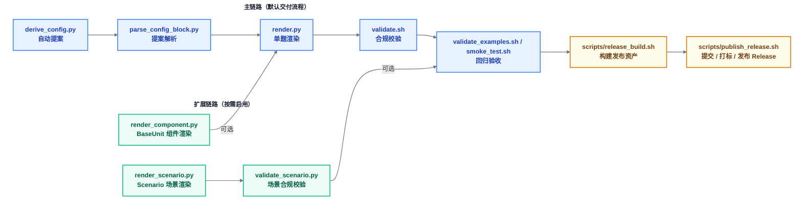

# CloverSec-CTF-Build-Dockerizer

<p align="center">
  <a href="README.md"><strong>简体中文</strong></a>
  <span> · </span>
  <a href="README.en.md"><strong>English</strong></a>
  <span> · </span>
  <a href="README.ja.md"><strong>日本語</strong></a>
</p>


<p align="center">
  
</p>
<p align="center">
  <a href="https://github.com/D1a0y1bb/CloverSec-CTF-Build-Dockerizer-skill/releases"></a>
  <a href="https://github.com/D1a0y1bb/CloverSec-CTF-Build-Dockerizer-skill"></a>
  <a href="https://github.com/D1a0y1bb/CloverSec-CTF-Build-Dockerizer-skill"></a>
</p>


<p align="center"><code><strong>VERSION</strong>: v2.0.2</code></p>

四叶草安全-创研中心竞赛 x Docker环境-专用容器构建 Skill。服务于竞赛、漏洞、基础镜像类的容器（题目）交付场景（CTF Jeopardy / Web / Pwn / AI / RDG / AWD / AWDP / SecOps / BaseUnit / Vulhub-like），可通过Agent&LLM工具使用此Skill技能将题目附件、源码、指定的目录转化为凌虚竞赛平台与星图大靶场引擎（市面主流所有竞赛平台）可直接运行的Docker镜像交付件，并通过自动化规则校验把构建质量稳定在可发布状态，减少人工试错 + 临场修补带来的不确定性。

如果你经历过赛前通宵补 Dockerfile、线上临时修 start.sh、打包后才发现平台契约不满足、客户临时需求改题目、收集漏洞题目镜像、转化外部仅有源码的历史CTF题目或CVE漏洞镜像，四叶草安全-创研中心竞赛 x Docker环境-专用容器构建 Skill 就是为这种场景而生的。让AI更高效更规范的去完成：安装、提案确认、单题渲染、场景编排、本地回归、发布打包。大幅度减少Agent工具自由发挥、浪费Token的行为、提高AI时代下的工作流质量对齐水平。

## V2.0.2 有哪些重大更新？

1、重大更新：目前已完整支持适配市面主流几乎所有竞赛平台的题目容器构建，包括 Jeopardy、RDG、AWD、AWDP、SecOps、BaseUnit 以及 Vulhub-like 风格的各种题目类型，一次适配即可覆盖绝大部分实际使用场景。

2、优化适配内容：v2.0.2 是真正意义上的能力跃迁版本，把之前多个长期存在的痛点问题进行了系统性补全和扩展，核心配置模型全面升级为以 challenge.profile + challenge.defense 为主口径，同时保留了 challenge.rdg 的兼容输入方式，便于老用户平滑过渡。平台交付契约也做了标准化优化，现在每次构建都会稳定输出 Dockerfile + start.sh + changeflag.sh 这三个核心文件，确保下游使用一致性。新增加了 stack=secops 和 stack=baseunit 两种模式，其中 secops 专门支持安全运维类题目（本质上是类 RDG 的变种），baseunit 则针对只需要快速起一个带指定服务包的最小服务镜像的场景，特别适合部分岗位的轻量交付需求。

3、渲染和校验流程优化：新增了 render_component.py、render_scenario.py、validate_scenario.py 这三个实用脚本，进一步完善了渲染和校验流程。针对 AWDP 模式，补丁契约也做了固定优化，现在统一采用 patch/src/（补丁源文件）+ patch/patch.sh（执行脚本）+ patch_bundle.tar.gz（最终补丁包）的结构，并且补丁包实现了确定性打包（相同输入永远产生相同输出，便于分发和校验）。在 scenario 层面，彻底补齐了 scenario-vulhub-like-basic，同时新增了从旧版 Vulhub 题目迁移到本项目的完整示例，迁移成本大幅降低。

4、重要修复与改进包括：解决了 stacks.yaml 中容易出现的重复定义问题，load_stack_defs 遇到重复 id 时会直接抛出报错并附带 Warning，强制要求修正而不是默默容忍；整体代码进行了精简和优化，逻辑更清晰、体积更小；文档体验全面升级，默认 README.md 改为中文完整手册，全部重新润色表述，不再依赖 AI 自动生成；同时补充了英文和日文版本的 README，项目显得更加国际化；新增了针对每种模式的独立构建手册（分别覆盖 Jeopardy / RDG / AWD / AWDP / SecOps / BaseUnit / Vulhub-like），方便按需查阅；还增加了文件级目录索引、常见问题 FAQ、排障指南以及发布验收清单等实用内容，让新手和老手都能更快上手。

5、重要内容：本项目经过此V2版本迭代后将不会迎来重大版本更新，有问题请及时提[Issues](https://github.com/D1a0y1bb/CloverSec-CTF-Build-Dockerizer-skill/issues)，欢迎👏二次开发与优化适配

## 核心能力矩阵



### 主链路（按顺序执行）

| 阶段 | 入口 | 作用 | 产出 |
|---|---|---|---|
| 1. 自动提案 | `derive_config.py` | 推断栈、端口、启动命令、runtime/profile 信号 | `config_proposal` |
| 2. 提案解析 | `parse_config_block.py` | 把 `CONFIG PROPOSAL` 转成规范 `challenge.yaml` | 标准化配置 |
| 3. 单题渲染 | `render.py` | 生成平台交付物 | `Dockerfile` `start.sh` `changeflag.sh` `flag(可选)` |
| 4. 合规校验 | `validate.sh` | 执行平台契约与风险规则检查 | `ERROR/WARN/INFO` |
| 5. 回归验收 | `validate_examples.sh` / `smoke_test.sh` | 批量回归与构建级冒烟 | 回归汇总 / pass-fail |

### 扩展链路（按场景启用）

| 场景能力 | 入口 | 作用 | 产出 |
|---|---|---|---|
| BaseUnit 组件渲染 | `render_component.py` | 生成“组件 + 指定版本”最小单元 | 可直接 `docker build` 的目录 |
| Scenario 场景渲染 | `render_scenario.py` | 渲染多服务本地编排 | 服务目录 + `docker-compose.yml` |
| Scenario 场景校验 | `validate_scenario.py` | 校验 mode/profile/端口/AWDP 补丁契约 | pass/fail |
| Release 打包与发布 | `scripts/release_build.sh` / `scripts/publish_release.sh` | 生成资产并发布 tag/release | zip/sbom/deps |

## Skills.sh 一键安装

先验证技能可发现，再执行安装：

```
npx -y skills add . --list
```

使用npx默认一键安装到通用agent目录下（.agents/)当前请根据你实际的需求选择安装到不同的项目或全局目录下）

```bash
npx skills add https://github.com/d1a0y1bb/cloversec-ctf-build-dockerizer-skill --skill CloverSec-CTF-Build-Dockerizer
```

安装后，建议先用示例目录做一次完整闭环，确认 Docker 与脚本依赖可用。

## 如何快速开始

### Agent-Orchestrated 流程（推荐）

标准提示词（建议直接复制）：

```text
请使用 CloverSec-CTF-Build-Dockerizer 处理当前题目目录。
先运行自动探测并输出 CONFIG PROPOSAL（含证据），
我确认后再生成 Dockerfile/start.sh/changeflag.sh 并执行 validate。
```

快捷业务提示词（懒人版）：

```text
当前 src 是我的 CTF 题目源码，请按平台交付规范构建完整容器并完成校验。
```

### 手动命令链

```bash
python3 src/CloverSec-CTF-Build-Dockerizer/scripts/derive_config.py --project-dir . --format json --pretty
python3 src/CloverSec-CTF-Build-Dockerizer/scripts/render.py --config challenge.yaml --output .
bash src/CloverSec-CTF-Build-Dockerizer/scripts/validate.sh Dockerfile start.sh challenge.yaml
```

### 运行时基座选择（PHP/Node/Java）

```bash
python3 src/CloverSec-CTF-Build-Dockerizer/scripts/render.py \
  --config challenge.yaml \
  --runtime-profile php74-apache \
  --output .
```

镜像优先级规则：`--base-image > --runtime-profile > challenge.base_image > infer/default`。

## 竞赛模式构建分类

### Jeopardy（Web / Pwn / AI）

适用：常规CTF竞赛的解题模式，默认 `profile=jeopardy`。

```bash
python3 src/CloverSec-CTF-Build-Dockerizer/scripts/render.py \
  --config src/CloverSec-CTF-Build-Dockerizer/examples/node-basic/challenge.yaml \
  --output /tmp/jeopardy-node

bash src/CloverSec-CTF-Build-Dockerizer/scripts/validate.sh \
  /tmp/jeopardy-node/Dockerfile \
  /tmp/jeopardy-node/start.sh \
  /tmp/jeopardy-node/challenge.yaml
```

### RDG

适用：防守运维 + check_service 计分场景，通常使用 `stack=rdg`。

```bash
python3 src/CloverSec-CTF-Build-Dockerizer/scripts/render.py \
  --config src/CloverSec-CTF-Build-Dockerizer/examples/rdg-python-ssti-basic/challenge.yaml \
  --output /tmp/rdg-python

bash src/CloverSec-CTF-Build-Dockerizer/scripts/validate.sh \
  /tmp/rdg-python/Dockerfile \
  /tmp/rdg-python/start.sh \
  /tmp/rdg-python/challenge.yaml
```

### AWD

适用：攻防混合赛，基于现有 Web/Pwn 栈叠加 `profile=awd` 与运维入口。

关键点：暂时不新增 `stack=awd`，而是现有 stack + `profile=awd`。

```bash
python3 src/CloverSec-CTF-Build-Dockerizer/scripts/render_scenario.py \
  --config src/CloverSec-CTF-Build-Dockerizer/examples/scenario-awd-basic/scenario.yaml \
  --output /tmp/scenario-awd

python3 src/CloverSec-CTF-Build-Dockerizer/scripts/validate_scenario.py \
  --output /tmp/scenario-awd
```

### AWDP

适用：attack + fix双竞赛模式下的题目，选手需要提交补丁包后通过竞赛平台上传后自动执行。

固定补丁模式：

- `patch/src/`
- `patch/patch.sh`
- `patch_bundle.tar.gz`

```bash
python3 src/CloverSec-CTF-Build-Dockerizer/scripts/render.py \
  --config src/CloverSec-CTF-Build-Dockerizer/examples/node-awdp-basic/challenge.yaml \
  --output /tmp/awdp-node

bash src/CloverSec-CTF-Build-Dockerizer/scripts/validate.sh \
  /tmp/awdp-node/Dockerfile \
  /tmp/awdp-node/start.sh \
  /tmp/awdp-node/challenge.yaml
```

### SecOps

适用：安全运维与加固配置类题目。`stack=secops + profile=secops` 已经做了独立语义，不再混入 RDG。

```bash
python3 src/CloverSec-CTF-Build-Dockerizer/scripts/render.py \
  --config src/CloverSec-CTF-Build-Dockerizer/examples/secops-nginx-basic/challenge.yaml \
  --output /tmp/secops-nginx

bash src/CloverSec-CTF-Build-Dockerizer/scripts/validate.sh \
  /tmp/secops-nginx/Dockerfile \
  /tmp/secops-nginx/start.sh \
  /tmp/secops-nginx/challenge.yaml
```

### BaseUnit（指定版本服务包最小单元）

适用：快速生成某组件某版本的纯服务基座镜像，避免现场手工编译踩坑。首批组件：`mysql`、`redis`、`sshd`、`ttyd`、`apache`、`nginx`、`tomcat`、`php-fpm`、`vsftpd`、`weblogic`。

```bash
python3 src/CloverSec-CTF-Build-Dockerizer/scripts/render_component.py --list

python3 src/CloverSec-CTF-Build-Dockerizer/scripts/render_component.py \
  --component redis \
  --variant 7.2-alpine \
  --profile jeopardy \
  --output /tmp/baseunit-redis

bash src/CloverSec-CTF-Build-Dockerizer/scripts/validate.sh \
  /tmp/baseunit-redis/Dockerfile \
  /tmp/baseunit-redis/start.sh \
  /tmp/baseunit-redis/challenge.yaml
```

### Vulhub-like（多服务漏洞环境迁移）

适用：把 Vulhub 风格的多服务场景迁移到本地 compose 编排 + 平台单服务交付。快速的完成历史CVE的本地靶场引擎的适配，`docker-compose.yml` 仅用于本地验证，平台交付仍是每个服务独立目录。

```bash
python3 src/CloverSec-CTF-Build-Dockerizer/scripts/render_scenario.py \
  --config src/CloverSec-CTF-Build-Dockerizer/examples/scenario-vulhub-like-basic/scenario.yaml \
  --output /tmp/scenario-vulhub-like

python3 src/CloverSec-CTF-Build-Dockerizer/scripts/validate_scenario.py \
  --output /tmp/scenario-vulhub-like
```

## 平台硬契约与边界

所有渲染产物必须满足：存在 `Dockerfile`。存在可执行 `start.sh`。存在可执行 `changeflag.sh`。容器内存在 `/bin/bash`。Dockerfile 声明 `EXPOSE`。`start.sh` 启动真实服务进程，禁止空转保活。

`flag` 规则：默认需要交付 `flag`。显式 `include_flag_artifact=false` 时，只能放行 `flag` 缺失，不能放行 `changeflag.sh` 缺失。

Scenario 边界：允许输出 `docker-compose.yml` 做本地编排。平台最终交付仍是单服务目录（`Dockerfile + start.sh + changeflag.sh`）。

## Workflow 演示案例

Prompt 触发


提案确认


错误闭环


自动产物


自动校验


硬约束检查


交付清单


## Build_test 样例（后期补充更新）

`Build_test/` 用来存放真实题目样例，方便你做可重复构建 + 可重复校验（实验性质，可参考此内容检验该Skill完成情况与基准测试）

| 样例目录 | 栈 | 端口 | 启动命令 | 主要文件 |
|---|---|---:|---|---|
| `Build_test/CTF-NodeJs RCE-Test1` | node | 3000 | `node app.js` | `challenge.yaml` `Dockerfile` `start.sh` `app.js` |
| `Build_test/CTF-Python沙箱逃逸-Test2` | python | 5000 | `python app.py` | `challenge.yaml` `Dockerfile` `start.sh` `Build_test/CTF-Python沙箱逃逸-Test2/src/app.py` |

复查命令：

```bash
cd "Build_test/CTF-NodeJs RCE-Test1"
npm ci
bash ../../src/CloverSec-CTF-Build-Dockerizer/scripts/validate.sh Dockerfile start.sh challenge.yaml

cd "../CTF-Python沙箱逃逸-Test2"
bash ../../src/CloverSec-CTF-Build-Dockerizer/scripts/validate.sh Dockerfile start.sh challenge.yaml
```

## 文件目录索引

### 根目录（发布与入口）

| 文件/目录 | 作用 |
|---|---|
| `README.md` | 中文默认完整手册（主入口） |
| `README.en.md` | 英文完整手册 |
| `README.ja.md` | 日文完整手册 |
| `README.zh-CN.md` | 中文兼容入口（历史链接跳转） |
| `VERSION` | 当前发布版本号 |
| `CHANGELOG.md` | 版本变更历史 |
| `LICENSE` | 开源许可证 |
| `Build_test/` | 真实题目构建回归样例 |
| `dist/` | `release_build` 生成的发布资产 |

### `scripts/`（仓库级治理与发布）

| 文件 | 作用 |
|---|---|
| `scripts/doc_guard.py` | 文档一致性门禁主实现 |
| `scripts/doc_guard.sh` | 文档门禁 Shell 入口 |
| `scripts/release_build.py` | release 打包主实现 |
| `scripts/release_build.sh` | release 打包入口 |
| `scripts/publish_guard.py` | 发布前版本/白名单守卫 |
| `scripts/publish_release.sh` | commit + push + tag + release 编排 |
| `scripts/generate_sbom.py` | SBOM 生成主实现 |
| `scripts/generate_sbom.sh` | SBOM 入口 |
| `scripts/sync.py` | 私有仓到发布仓同步逻辑 |
| `scripts/sync.sh` | 同步入口 |

### `src/CloverSec-CTF-Build-Dockerizer/data`（规则与配置数据）

| 文件 | 作用 |
|---|---|
| `schema.md` | `challenge.yaml` 输入契约 |
| `scenario_schema.md` | `scenario.yaml` 输入契约 |
| `stacks.yaml` | 栈默认值与模板映射 |
| `profiles.yaml` | profile 默认行为定义 |
| `components.yaml` | BaseUnit 组件与版本变体 |
| `runtime_profiles.yaml` | 运行时档位定义（php/node/java） |
| `patterns.yaml` | 自动探测规则 |
| `validate_rules.yaml` | `validate.sh` 规则配置 |
| `validate_scenario_rules.yaml` | scenario 校验规则配置 |
| `base_image_allowlist.yaml` | 基础镜像白名单 |
| `README.md` | data 目录说明 |

### `src/CloverSec-CTF-Build-Dockerizer/scripts`（渲染/校验核心脚本）

| 文件 | 作用 |
|---|---|
| `derive_config.py` | 自动推断 challenge 配置 |
| `parse_config_block.py` | 解析 CONFIG PROPOSAL |
| `render.py` | 单题渲染入口 |
| `render_component.py` | BaseUnit 组件渲染入口 |
| `render_scenario.py` | 场景编排渲染入口 |
| `validate.sh` | 单题契约校验入口 |
| `validate_scenario.py` | 场景契约校验入口 |
| `validate_examples.sh` | examples 批量回归 |
| `smoke_test.sh` | 冒烟测试 |
| `validate_context.py` | challenge 上下文解析辅助 |
| `autofix.py` | 常见问题自动修复辅助 |
| `detect_stack.py` | 栈识别辅助 |
| `utils.py` | 公共工具函数 |
| `cleanup_test_containers.sh` | 测试容器清理 |
| `test_runtime_profiles.sh` | runtime profiles 回归 |
| `README.md` | scripts 目录说明 |

### `src/CloverSec-CTF-Build-Dockerizer/templates`（模板库）

| 路径 | 作用 |
|---|---|
| `templates/node|php|python|java|tomcat|lamp|pwn|ai/` | Jeopardy 栈模板 |
| `templates/rdg/` | RDG 专用模板 |
| `templates/secops/` | SecOps 专用模板 |
| `templates/baseunit/` | BaseUnit 通用模板 |
| `templates/snippets/` | defense/check/changeflag 等片段 |
| `templates/README.md` | 模板目录说明 |

### `src/CloverSec-CTF-Build-Dockerizer/examples`（示例与回归输入）

| 路径 | 作用 |
|---|---|
| `examples/*-basic` | 单题最小示例（node/php/python/...） |
| `examples/node-awdp-basic` | AWDP 单题补丁契约示例 |
| `examples/secops-*-basic` | SecOps 示例 |
| `examples/baseunit-*` | BaseUnit 示例 |
| `examples/scenario-awd-basic` | AWD 场景示例 |
| `examples/scenario-awdp-basic` | AWDP 场景示例 |
| `examples/scenario-vulhub-like-basic` | Vulhub-like 迁移示例 |
| `examples/README.md` | 示例目录说明 |

### `src/CloverSec-CTF-Build-Dockerizer/docs`（设计文档）

| 文件 | 作用 |
|---|---|
| `architecture_overview.md` | 架构总览 |
| `platform_contract.md` | 平台硬契约说明 |
| `stack_cookbook.md` | 各栈构建建议 |
| `directory_guide.md` | 目录设计说明 |
| `troubleshooting.md` | 常见故障排查 |
| `beginner_guide.md` | 新手入门流程 |

## FAQ 与常见排障

### Q1：为什么必须有 `/start.sh`、`/changeflag.sh`、`/bin/bash`？

这是凌虚竞赛平台&星图大靶场引擎的运行契约（实际上适配市面上任意一家的竞赛平台与靶场Docker启动引擎）。缺任一项都可能导致题目无法被平台正常启动或重置。

### Q2：为什么我设置了 `include_flag_artifact=false` 还报错？

这个开关只允许 `flag` 缺失，不允许 `changeflag.sh` 缺失。请检查渲染目录里 `changeflag.sh` 是否存在且可执行。

### Q3：AWD 和 SecOps 看起来很像，怎么选？

你要做攻防对抗，选“现有栈 + `profile=awd`”。你要做加固运维，选 `stack=secops + profile=secops`。

### Q4：AWDP 为什么不是直接 SSH 修题？

AWDP 的关键是“补丁提交与审计”，不是现场运维。选手通过 `patch/src + patch.sh + tar.gz` 提交修复，平台再自动应用。

### Q5：Vulhub-like 场景为什么不能直接拿 compose 当最终交付？

因为目标平台要求单服务交付目录。`scenario` 的 compose 只用于你本地联调与验证拓扑。

### Q6：`npx -y skills add . --list` 和 Release 资产有关系吗？

没有直接依赖。前者验证技能可发现，后者是版本归档分发。

## 维护、贡献与发布

发布前最小检查清单：

```bash
bash scripts/doc_guard.sh
bash src/CloverSec-CTF-Build-Dockerizer/scripts/validate_examples.sh
bash src/CloverSec-CTF-Build-Dockerizer/scripts/smoke_test.sh
npx -y skills add . --list
bash scripts/release_build.sh
```

正式发布：

```bash
bash scripts/publish_release.sh --version v2.0.2
```

如果遇到远端 tag/release 冲突或认证失败，应该停止发布流程并先处理阻塞，不要临时修改版本号绕过。

## License

本项目使用 [MIT License](LICENSE)，版权所属@D1a0y1bb.
