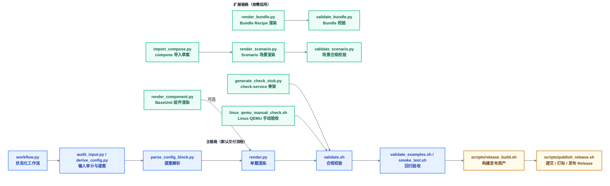

# CloverSec-CTF-Build-Dockerizer

<p align="center">
  <a href="README.md"><strong>简体中文</strong></a>
  <span> · </span>
  <a href="README.en.md"><strong>English</strong></a>
  <span> · </span>
  <a href="README.ja.md"><strong>日本語</strong></a>
</p>
<p align="center">
  
</p>
<p align="center">
  <a href="https://github.com/D1a0y1bb/CloverSec-CTF-Build-Dockerizer-skill/releases"></a>
  <a href="https://github.com/D1a0y1bb/CloverSec-CTF-Build-Dockerizer-skill"></a>
  <a href="https://github.com/D1a0y1bb/CloverSec-CTF-Build-Dockerizer-skill"></a>
</p>


<p align="center"><code><strong>VERSION</strong>: v2.2.0-r9</code></p>

四叶草安全-创研中心竞赛 x Docker环境-专用容器构建 Skill。服务于竞赛、漏洞、基础镜像类的容器（题目）交付场景（CTF Jeopardy / Web / Pwn / AI / RDG / AWD / AWDP / SecOps / BaseUnit / Scenario/Vulhub-like / Bundle/Recipe / Linux-QEMU），可通过 Agent 与 LLM 工具把题目附件、源码、指定目录转化为适配当前已验证竞赛平台与靶场交付约束的 Docker 镜像交付件，并通过自动化规则校验把构建质量稳定在可发布状态，减少人工试错与临场修补带来的不确定性。

如果你经历过赛前通宵补 Dockerfile、线上临时修 start.sh、打包后才发现平台契约不满足、客户临时需求改题目、收集漏洞题目镜像、转化外部仅有源码的历史CTF题目或CVE漏洞镜像，四叶草安全-创研中心竞赛 x Docker环境-专用容器构建 Skill 就是为这种场景而生的。让AI更高效更规范的去完成：安装、提案确认、单题渲染、场景编排、本地回归、发布打包。大幅度减少Agent工具自由发挥、浪费Token的行为、提高AI时代下的工作流质量对齐水平。

如果用一句话概括现在这个 Skill 的工作形态，那就是：从“让模型阅读一份巨大的操作手册并自己决定怎么做”，变成了“由 Workflow 控制执行阶段，模型只在当前阶段获取需要的信息并完成对应任务”。旧版本本质上是把 Docker 构建规范、题目规范、交付标准、验收规则、交互要求等全部塞进 SKILL.md，每次执行任务都让模型重新阅读和理解一遍，所以输入 Token 很大，而且很多规则实际上是在不断重复发送。新版本则把这些内容拆解成状态化流程，用户提交任务后先进入 Intake 阶段识别题目类型和基本信息，然后进入 Proposal 阶段生成构建方案，用户确认后再进入 Render 阶段生成 Dockerfile、start.sh、challenge.yaml 等交付物，最后进入 Validate 阶段执行验收检查。每个阶段只读取当前需要的文档和规则，而不是加载整个知识体系，因此模型不再承担“记住所有规则”的职责，而是通过 Workflow 决定当前应该执行什么、读取什么、输出什么。这样做带来的收益并不只是 Token 下降，而是将原本依赖 Prompt 和记忆维持的流程约束转移到了 Workflow 本身，复杂能力仍然保留，但只在需要的时候展开。模型负责理解和生成，Workflow 负责阶段控制和行为约束，Knowledge 负责提供对应阶段所需的规范和模板。最终形成的是一种按需加载、状态驱动、渐进式披露的 Skill 运行模式，在保持原有构建能力和交付标准的前提下，大幅降低上下文负担和无效推理开销，这也是为什么在真实 API 调用记录中能够看到输入 Token 降低 96.2%、总 Token 降低 72.3%、费用降低 47.5% 和耗时降低 27.9% 的根本原因。

## V2.2.0-R9 发布修复

`v2.2.0-r9` 是 `v2.2.0` 的第九个发布修复版本，不改变 `challenge.yaml` 配置契约和脚本核心行为。重点是把独立 GitHub skill、插件内置 skill 和本机安装 skill 的入口说明同步一致。

本次 r9 修复覆盖：

- `SKILL.md` 和 `agents/openai.yaml` 以插件内置 Dockerizer 为准，统一推荐 `workflow.py auto-render`。
- 普通题目默认生成平台交付文件并执行静态校验；真实启动未知容器、高权限运行或业务取舍不清楚时再停止询问。
- Java JAR 示例的 `build/` 文件进入独立仓库版本管理，避免独立 skill 发布包和插件内置 skill 内容不一致。

## V2.2.0-R8 发布修复

`v2.2.0-r8` 是 `v2.2.0` 的第八个发布修复版本，不改变 `challenge.yaml` 配置契约。重点处理真实使用中发现的 Python Web 源码 proposal 风险、换行格式和动态 flag 校验问题。

本次 r8 修复覆盖：

- Python Web 源码审计会识别缺失的本地 import、Flask template、依赖声明、启动命令证据和 `FLAG`/`CTF_FLAG` 环境变量读取；存在阻断项时 `auto-render` 会停止并要求人工确认。
- 渲染与派生配置输出统一使用 LF，避免 CRLF 进入平台交付脚本。
- `validate.sh` 会明确报告 CRLF，并验证位置参数、`FLAG`、`CTF_FLAG` 三种动态 flag 更新方式。
- `workflow.py auto-render` 默认执行动态 flag 校验，减少只通过静态检查但平台改 flag 失败的情况。

## V2.2.0-R7 发布修复

`v2.2.0-r7` 是 `v2.2.0` 的第七个发布修复版本，不改变 `challenge.yaml` 配置契约和核心单题渲染行为。重点处理官方 Skill 校验兼容、输入提示展示位置、Docker artifact 归档字段和示例大文件管理。

本次 r7 修复覆盖：

- 按官方 Skill 校验规则移除非标准顶层字段，把 `challenge.yaml` 与 `--project-dir` 的输入提示移入 `SKILL.md` 正文和 `agents/openai.yaml` 默认提示。
- 保留 Docker artifact 工作流，继续输出 `environment`、`docker_artifacts` 与 `xlsx_fields`，方便归档阶段生成 amd64 镜像包、导出 tar 包和表格字段。
- 删除不适合随 Git 管理的 Linux-QEMU 示例 `initrd.img`，并通过 `.gitignore` 阻止该大文件再次进入源码提交。

## V2.2.0 重大更新

v2.2.0 是 历时几个月来我们对广泛的使用问题和 Agent 工作流下的部分优化的一次集中升级。重点处理了 Agent 工作中真实比赛题目交付一些更常见的问题：题目目录不干净、输入来源混杂、历史项目带有 compose 或 Vulhub-like 结构，Linux kernel CVE / LPE 题目也不能直接依赖普通 Docker 环境还原。同时我们还大幅度的优化了该 Skill 的工程结构以及一些使用 skill 后的context 工程的管理问题，使得在相同的任务下占用的上下文内容更少、加载更快、token 消耗更少、更省心、Enjoy！

本次更新主要包括：

1、真实比赛场景构建覆盖更全

v2.2.0 覆盖 Jeopardy、Web、Pwn、AI、RDG、AWD、AWDP、SecOps、BaseUnit、Scenario/Vulhub-like、Bundle/Recipe、Linux-QEMU 等场景。面向比赛平台的最终交付件仍保持单服务 Dockerfile + start.sh + changeflag.sh 格式，多服务编排主要用于本地验证、迁移和整理复杂题目

2、Linux kernel CVE / LPE 题目有了专门交付方式

这类题目过去很难放进普通 Docker：容器默认共享宿主机内核，很多内核漏洞和本地提权题放进去后，环境会失真，甚至根本无法复现。v2.2.0 我们创新性的引入 Linux-QEMU 流程（套娃）。比赛平台看到的仍然是一个 Docker 交付件，容器内部再启动独立的 Linux 题目环境，用来承载指定内核、rootfs 和题目服务。这样既保留平台需要的交付形式，也能让 Linux kernel CVE / LPE 题目获得更接近真实漏洞现场的运行环境。我们可以逐步的摆脱 KVM 和 QEMU 传统的 iso、qcow2 大体积镜像维护和制作的难度

3、复杂输入会先确认方案

混合输入、脏目录、高风险输入、compose/Vulhub-like 项目、Linux-QEMU 缺少资产、cPanel/WHM 类输入，都会进入 proposal 确认流程。确有人工确认时，可以写明原因，记录会进入文本或 JSON 输出，后面回看发布过程时能知道当时为什么继续。

4、样例验证更贴近真实项目

validate_examples.sh 默认只读，不再改写 examples/。Build_test/ 升级为真实样例池，可以区分预期通过和预期失败。Scenario 会按服务逐项验证，Linux-QEMU 也提供从预检查到完整验证的分级检查，方便按题目阶段选择验证强度。

5、Bundle、Compose 和服务检查能力扩展

v2.2.0 新增 Bundle Recipe 原型、compose/Vulhub-like 导入草案，以及 HTTP、TCP、Redis、MySQL、SSH 的 check-service 骨架。

6、发布前状态更清楚

渲染、场景验证和发布检查支持结构化输出

7、渐进式披露原则适配-Skill 入口更轻

SKILL.md 从 1089 行降到 206 行，入口减少约 81.1%；字节数从 39254 降到 10204，减少约 74.0%。我们大幅度的优化了context 工程的管理，使得在相同的任务下占用的上下文内容更少、加载更快。

## 核心能力矩阵


```mermaid
flowchart LR
    subgraph Main["主链路（默认交付流程）"]
        direction LR
        A["workflow.py\n状态化工作流"] --> B["audit_input.py / derive_config.py\n输入审计与提案"]
        B --> C["parse_config_block.py\n提案解析"]
        C --> D["render.py\n单题渲染"]
        D --> E["validate.sh\n合规校验"]
        E --> K["validate_examples.sh / smoke_test.sh\n回归验收"]
    end

    subgraph Ext["扩展链路（按需启用）"]
        direction LR
        F["render_component.py\nBaseUnit 组件渲染"] -->|可选| D
        G["render_bundle.py\nBundle Recipe 渲染"] --> L["validate_bundle.py\nBundle 校验"]
        M["import_compose.py\ncompose 导入草案"] --> N["render_scenario.py\nScenario 场景渲染"]
        N --> H["validate_scenario.py\n场景合规校验"]
        O["generate_check_stub.py\ncheck-service 骨架"] --> E
        P["linux_qemu_manual_check.sh\nLinux-QEMU 手动验收"] --> E
    end

    K --> I["scripts/release_build.sh\n构建发布资产"]
    I --> J["scripts/publish_release.sh\n提交 / 打标 / 发布 Release"]

    %% ──────────────────────────────────────────────
    %%          优化后的配色与样式（2025-2026流行风）
    %% ──────────────────────────────────────────────
    classDef main fill:#e8f1ff,stroke:#3b82f6,stroke-width:2px,color:#1e40af,font-weight:bold
    classDef ext  fill:#ecfdf5,stroke:#10b981,stroke-width:2px,color:#065f46,font-weight:bold
    classDef rel  fill:#fffbeb,stroke:#d97706,stroke-width:2px,color:#713f12,font-weight:bold
    classDef title fill:none,stroke:none,color:#111827,font-size:15px,font-weight:600

    class A,B,C,D,E,K main
    class F,G,H,L,M,N,O,P ext
    class I,J rel

    class Main,Ext title

    %% 连接线微调（可选，根据渲染引擎支持程度）
    linkStyle default stroke:#6b7280,stroke-width:1.5px
```

### 主链路（按顺序执行）

| 阶段 | 入口 | 作用 | 产出 |
|---|---|---|---|
| 1. 状态化工作流 | `workflow.py` | 依次完成题目分析、方案生成、确认、交付生成和验证 | `.ctfbuild/session.json` |
| 2. 输入审计与提案 | `audit_input.py` / `derive_config.py` | 推断栈、端口、启动命令、运行环境和风险等级 | 风险审计结果 / 构建方案 |
| 3. 提案解析 | `parse_config_block.py` | 把方案确认内容转成规范 `challenge.yaml` | 标准化配置 |
| 4. 单题渲染 | `render.py` | 生成平台交付物 | `Dockerfile` `start.sh` `changeflag.sh` `flag(可选)` |
| 5. 合规校验 | `validate.sh` | 执行平台契约与风险规则检查 | `ERROR/WARN/INFO` / JSON summary |
| 6. 回归验收 | `validate_examples.sh` / `smoke_test.sh` | 批量回归与构建级冒烟 | 回归汇总 / pass-fail |

### 扩展链路（按场景启用）

| 场景能力 | 入口 | 作用 | 产出 |
|---|---|---|---|
| BaseUnit 组件渲染 | `render_component.py` | 生成“组件 + 指定版本”最小单元 | 可直接 `docker build` 的目录 |
| Bundle/Recipe 渲染 | `render_bundle.py` / `validate_bundle.py` | 生成并校验固定 Recipe 或显式 custom 单容器多服务组合 | 标准交付目录 |
| compose/Vulhub-like 导入 | `import_compose.py` | 生成完整 draft、可渲染子集和导入报告，保留端口、环境变量、依赖、网络、健康检查等迁移线索 | `scenario.draft.yaml` / `scenario.renderable.yaml` / `import-report.json` |
| check-service 骨架 | `generate_check_stub.py` | 生成 HTTP/TCP/Redis/MySQL/SSH 检查脚本骨架，支持状态码、关键文本、Redis key、MySQL query 等断言 | 待人工确认的 `check/check.sh` |
| Linux-QEMU 内核题渲染 | `render.py` | 生成 Docker 内 QEMU guest 启动环境 | 单镜像交付目录 |
| Linux-QEMU 手动验收 | `scripts/linux_qemu_manual_check.sh` | 执行 preflight/static/build/boot/flag/full 分级检查 | JSON summary / 证据记录 |
| Scenario 场景渲染 | `render_scenario.py` | 渲染多服务本地编排 | 服务目录 + `docker-compose.yml` |
| Scenario 场景校验 | `validate_scenario.py` | 校验 mode/profile/端口/AWDP 补丁契约 | pass/fail |
| 真实样例池回归 | `scripts/validate_build_test.py` | 按预期通过/预期失败验证 Build_test 样例 | structured summary |
| Release 打包与发布 | `scripts/release_build.sh` / `scripts/publish_release.sh` | 生成资产并发布 tag/release | zip/sbom/deps |

## 一键安装与 Skill 发现

先验证技能可发现，再执行安装：

```bash
npx -y skills add . --list

npx -y skills add \
  https://github.com/D1a0y1bb/CloverSec-CTF-Build-Dockerizer-skill \
  --skill cloversec-ctf-build-dockerizer \
  --agent codex -y
```

安装后，建议先用示例目录完整执行一次，确认 Docker 与脚本依赖可用。

### Codex UI 展示策略

当前 Skill 在 Codex UI 中的展示信息由 `src/CloverSec-CTF-Build-Dockerizer/agents/openai.yaml` 控制，主要包括：

- `display_name`：技能卡片标题
- `short_description`：技能卡片副标题
- `brand_color`：卡片品牌色
- `default_prompt`：点击试用或直接调用时的默认提示词
- `allow_implicit_invocation`：允许模型在匹配场景下隐式触发该 Skill

当前默认提示词策略是：先分析题目目录，整理证据、风险点和缺失信息，给出构建方案；用户确认后，再生成 Docker 交付件并执行验证。这一层只影响 Codex UI 中“技能怎么展示、怎么起手”，不改变 `workflow.py`、`render.py`、`validate.sh`、`render_component.py`、`render_scenario.py` 的运行时逻辑。

如果后续你想调整 Codex 里的卡片标题、简介文案或试用提示词，优先改这里，而不是去改 `README` 正文：

```yaml
interface:
  display_name: "CloverSec CTF Build Dockerizer"
  short_description: "将 CTF 题目整理为可验证的 Docker 交付件，支持内核题与多服务场景"
  default_prompt: "使用 $cloversec-ctf-build-dockerizer 处理当前题目目录。先分析题目结构、风险点和缺失信息，给出构建方案；用户确认后，再生成 Docker 交付件并执行验证。"
```

## 如何快速开始

### AI 辅助流程（推荐）

标准提示词（建议直接复制）：

```text
请使用 CloverSec-CTF-Build-Dockerizer 处理当前题目目录。
先分析题目结构、风险点和缺失信息，给出构建方案。
我确认后，再生成 Docker 交付件并执行验证。
```

快捷业务提示词（懒人版）：

```text
当前 src 是我的 CTF 题目源码，请先按平台交付规范分析目录并给出构建方案。
我确认后，再生成完整容器交付件并完成校验。
```

### 手动命令链（源码仓库环境）

以下命令适用于源码仓库目录。已安装 Skill 由 Agent 自动解析 Skill 根目录，不需要加 `src/CloverSec-CTF-Build-Dockerizer/` 前缀。

确认前：

```bash
python3 src/CloverSec-CTF-Build-Dockerizer/scripts/workflow.py intake --project-dir .
python3 src/CloverSec-CTF-Build-Dockerizer/scripts/workflow.py propose --project-dir .
python3 src/CloverSec-CTF-Build-Dockerizer/scripts/workflow.py status --project-dir .
```

用户确认方案后：

```bash
python3 src/CloverSec-CTF-Build-Dockerizer/scripts/workflow.py accept --project-dir .
python3 src/CloverSec-CTF-Build-Dockerizer/scripts/workflow.py render --project-dir .
python3 src/CloverSec-CTF-Build-Dockerizer/scripts/workflow.py validate --project-dir .
```

### 运行时基座选择（PHP/Node/Java）

```bash
python3 src/CloverSec-CTF-Build-Dockerizer/scripts/render.py \
  --config challenge.yaml \
  --runtime-profile php74-apache \
  --output .
```

镜像优先级规则：`--base-image > CLI --runtime-profile > challenge.base_image > challenge.runtime_profile > infer/default`。也就是说，`challenge.yaml` 里明确写的 `base_image` 不会再被自动推断出的 runtime profile 覆盖。

历史题迁移建议同时确认三件事：

- 原题基础镜像或运行时版本，例如 PHP 7.4、Node 14、JDK 8。
- Pwn 题镜像架构，必要时设置 `platform.docker_platform: linux/amd64`。
- 题目业务实际读取的 flag 路径，必要时设置 `flag.sync_paths`。

## AI Coding Playbook

本节只写实际调用方式：让 Agent 先确认方案，再生成和验证。

### Codex

调用方式：在仓库根目录工作，强制走“方案 -> 确认 -> 生成 -> 验证”。

推荐提示词：

```text
使用 CloverSec-CTF-Build-Dockerizer 处理当前目录。
先检查题目结构、风险点和缺失信息。
我确认构建方案后，再生成交付文件并执行对应验证命令。
目标模式：<jeopardy|rdg|awd|awdp|secops|baseunit|scenario|bundle|linux-qemu|compose-import>。
```

重试提示词：

```text
不要重新执行全部流程。只修当前 ERROR 项，
然后重跑必要检查，并汇报修改文件和命令结果。
```

验收命令：

```bash
bash scripts/doc_guard.sh
bash src/CloverSec-CTF-Build-Dockerizer/scripts/validate_examples.sh
```

## 竞赛模式构建分类

### Jeopardy（Web / Pwn / AI）

适用：常规CTF竞赛的解题模式，默认 `profile=jeopardy`。

```bash
python3 src/CloverSec-CTF-Build-Dockerizer/scripts/render.py \
  --config src/CloverSec-CTF-Build-Dockerizer/examples/node-basic/challenge.yaml \
  --output /tmp/jeopardy-node

bash src/CloverSec-CTF-Build-Dockerizer/scripts/validate.sh \
  /tmp/jeopardy-node/Dockerfile \
  /tmp/jeopardy-node/start.sh \
  /tmp/jeopardy-node/challenge.yaml
```

### Linux-QEMU（Linux kernel CVE / LPE）

适用：需要指定 guest kernel、initrd/rootfs、内核模块或内核配置的 Linux kernel 漏洞题。典型形态是外层 Docker 负责平台交付，内层 QEMU guest 负责漏洞环境。

建议配置形态：

```yaml
challenge:
  name: kernel-cve-demo
  stack: linux-qemu
  profile: jeopardy
  base_image: debian:bookworm-slim
  workdir: /opt/kernel-qemu
  expose_ports: ["22"]
  start:
    mode: cmd
    cmd: "qemu-system-x86_64"
  vm:
    arch: x86_64
    accelerator: tcg
    memory: 768M
    cpus: 2
    kernel: vm/vmlinuz
    initrd: vm/initrd.img
    rootfs: vm/rootfs.ext4
    append: "console=ttyS0 root=/dev/vda rw"
    guest_forwards:
      - proto: tcp
        host_port: "22"
        guest_port: "22"
    guest_flag_path: /root/flag
    flag_injection: debugfs
    healthcheck_mode: ssh-banner
```

交付要求：

- `/start.sh` 前台执行 QEMU，并显式设置 `-m`、`-smp`、`-nographic`、网络与 `hostfwd`。
- 默认使用 TCG；KVM 只能作为显式可选项，平台不应自动使用 `--privileged`。
- `EXPOSE`、平台端口映射、QEMU `hostfwd` 三处要对应。
- `changeflag.sh` 如果只写 `/flag`，guest 内不会自动看到新 flag；内层 flag 路径需要单独写入 rootfs 或由 guest 启动脚本读取。
- PoC/EXP 不建议进入镜像，作为附件与题解资料管理。
- 大型 kernel/rootfs 示例不建议进入默认 CI，完整启动验证应在 release/manual 阶段执行。
- 真实 VM 资产用 `asset_manifest.yaml` 记录文件名、大小和 SHA256；大文件仍放在外部目录。

Release/manual 验证入口：

```bash
python3 src/CloverSec-CTF-Build-Dockerizer/scripts/verify_asset_manifest.py --manifest /path/to/asset_manifest.yaml
bash scripts/linux_qemu_manual_check.sh --mode preflight --case-dir /path/to/linux-qemu/code --asset-manifest /path/to/asset_manifest.yaml
bash scripts/linux_qemu_manual_check.sh --mode boot --case-dir /path/to/linux-qemu/code --host-port 2222
```

详细分层、TCG/KVM 边界、动态 flag 写入和 PoC 证据记录见 `src/CloverSec-CTF-Build-Dockerizer/docs/linux_qemu_manual_validation.md`。

### RDG

适用：防守运维 + check_service 计分场景，通常使用 `stack=rdg`。

```bash
python3 src/CloverSec-CTF-Build-Dockerizer/scripts/render.py \
  --config src/CloverSec-CTF-Build-Dockerizer/examples/rdg-python-ssti-basic/challenge.yaml \
  --output /tmp/rdg-python

bash src/CloverSec-CTF-Build-Dockerizer/scripts/validate.sh \
  /tmp/rdg-python/Dockerfile \
  /tmp/rdg-python/start.sh \
  /tmp/rdg-python/challenge.yaml
```

可用 `generate_check_stub.py` 生成 HTTP/TCP/Redis/MySQL/SSH 的可编辑 check-service 骨架：

```bash
python3 src/CloverSec-CTF-Build-Dockerizer/scripts/generate_check_stub.py \
  --type http \
  --output /tmp/rdg-python/check/check.sh \
  --target-port 80 \
  --path / \
  --expect-status 200 \
  --expect-text "login"
```

生成脚本默认带 `CHECK_REVIEW_REQUIRED`，`validate.sh` 会阻断发布，直到人工确认并移除标记。HTTP 还支持 `--forbid-text`、`--expect-header`、`--forbid-header`；Redis 支持 `--redis-key` / `--redis-expect-value`；MySQL 支持 `--mysql-query` / `--mysql-expect-text`。

### AWD

适用：攻防混合赛，基于现有 Web/Pwn 栈叠加 `profile=awd` 与运维入口。

关键点：暂时不新增 `stack=awd`，而是现有 stack + `profile=awd`。

```bash
python3 src/CloverSec-CTF-Build-Dockerizer/scripts/render_scenario.py \
  --config src/CloverSec-CTF-Build-Dockerizer/examples/scenario-awd-basic/scenario.yaml \
  --output /tmp/scenario-awd \
  --accepted \
  --reason "user accepted AWD scenario example"

python3 src/CloverSec-CTF-Build-Dockerizer/scripts/validate_scenario.py \
  --output /tmp/scenario-awd
```

上面的命令只校验 scenario/compose 结构；如需同时调用 `validate.sh` 检查每个服务目录，可追加：

```bash
python3 src/CloverSec-CTF-Build-Dockerizer/scripts/validate_scenario.py \
  --output /tmp/scenario-awd \
  --validate-rendered
```

批量回归入口 `validate_examples.sh` 和 `smoke_test.sh` 默认会对 scenario 示例执行逐服务交付校验，也就是自动追加等价的 `--validate-rendered`。如只需要轻量结构校验，可设置 `SCENARIO_VALIDATE_RENDERED=0`。

### AWDP

适用：attack + fix双竞赛模式下的题目，选手需要提交补丁包后通过竞赛平台上传后自动执行。

固定补丁模式：

- `patch/src/`
- `patch/patch.sh`
- `patch_bundle.tar.gz`

```bash
python3 src/CloverSec-CTF-Build-Dockerizer/scripts/render.py \
  --config src/CloverSec-CTF-Build-Dockerizer/examples/node-awdp-basic/challenge.yaml \
  --output /tmp/awdp-node

bash src/CloverSec-CTF-Build-Dockerizer/scripts/validate.sh \
  /tmp/awdp-node/Dockerfile \
  /tmp/awdp-node/start.sh \
  /tmp/awdp-node/challenge.yaml
```

### SecOps

适用：安全运维与加固配置类题目。`stack=secops + profile=secops` 已经做了独立语义，不再混入 RDG。

```bash
python3 src/CloverSec-CTF-Build-Dockerizer/scripts/render.py \
  --config src/CloverSec-CTF-Build-Dockerizer/examples/secops-nginx-basic/challenge.yaml \
  --output /tmp/secops-nginx

bash src/CloverSec-CTF-Build-Dockerizer/scripts/validate.sh \
  /tmp/secops-nginx/Dockerfile \
  /tmp/secops-nginx/start.sh \
  /tmp/secops-nginx/challenge.yaml
```

### BaseUnit（指定版本服务包最小单元）

适用：快速生成某组件某版本的纯服务基座镜像，避免现场手工编译踩坑。首批组件：`mysql`、`redis`、`sshd`、`ttyd`、`apache`、`nginx`、`tomcat`、`php-fpm`、`vsftpd`、`weblogic`。

```bash
python3 src/CloverSec-CTF-Build-Dockerizer/scripts/render_component.py --list

python3 src/CloverSec-CTF-Build-Dockerizer/scripts/render_component.py \
  --component redis \
  --variant 7.2-alpine \
  --profile jeopardy \
  --output /tmp/baseunit-redis

bash src/CloverSec-CTF-Build-Dockerizer/scripts/validate.sh \
  /tmp/baseunit-redis/Dockerfile \
  /tmp/baseunit-redis/start.sh \
  /tmp/baseunit-redis/challenge.yaml
```

### Bundle / Recipe（老环境组合）

适用：单容器多服务老环境。BaseUnit 是单组件，Scenario 是本地多服务编排，Bundle 是一个 Docker 镜像内的 Recipe。已知组合可用固定 Recipe；未知组合可用显式 custom 配置，但必须写清 base image、安装命令、启动命令、端口和服务清单。

```bash
python3 src/CloverSec-CTF-Build-Dockerizer/scripts/render_bundle.py \
  --recipe legacy-centos7-python39-mysql57-redis5 \
  --output /tmp/bundle-centos7

python3 src/CloverSec-CTF-Build-Dockerizer/scripts/validate_bundle.py \
  --bundle-dir /tmp/bundle-centos7
```

当前固定 Recipe 为 `legacy-centos7-python39-mysql57-redis5` 与 `tomcat85-jdk8-mysql57`，均为 `support_level=partial`。显式 custom 示例见 `examples/bundle-custom-explicit/`。旧系统包源和 MySQL 5.7 安装方式可能需要人工处理，默认回归只要求 render 与静态契约校验。

### Vulhub-like（多服务漏洞环境迁移）

适用：把 Vulhub 风格的多服务场景迁移到本地 compose 编排 + 平台单服务交付。快速的完成历史CVE的本地靶场引擎的适配，`docker-compose.yml` 仅用于本地验证，平台交付仍是每个服务独立目录。

```bash
python3 src/CloverSec-CTF-Build-Dockerizer/scripts/render_scenario.py \
  --config src/CloverSec-CTF-Build-Dockerizer/examples/scenario-vulhub-like-basic/scenario.yaml \
  --output /tmp/scenario-vulhub-like \
  --accepted \
  --reason "user accepted Vulhub-like scenario example"

python3 src/CloverSec-CTF-Build-Dockerizer/scripts/validate_scenario.py \
  --output /tmp/scenario-vulhub-like
```

上面的命令只校验 scenario/compose 结构；如需同时调用 `validate.sh` 检查每个服务目录，可追加 `--validate-rendered`。批量回归入口默认会执行逐服务交付校验；设置 `SCENARIO_VALIDATE_RENDERED=0` 可恢复为仅检查 scenario/compose 结构。

已有 `docker-compose.yml` 的目录可先生成导入草案：

```bash
python3 src/CloverSec-CTF-Build-Dockerizer/scripts/import_compose.py \
  --compose path/to/docker-compose.yml \
  --output /tmp/compose-import \
  --scenario-name imported-scenario
```

该命令会同时生成完整 `scenario.draft.yaml`、可渲染子集 `scenario.renderable.yaml` 和 `import-report.json`。draft 会保留 ports、environment、depends_on、volumes、networks、healthcheck、command/entrypoint 等线索；只有可渲染子集适合继续交给 `render_scenario.py`。

构建级 smoke 支持可选业务断言文件 `smoke_assert.yaml`：

```yaml
assertions:
  - type: http
    path: /
    expect_status: 200
    expect_text: "login"
  - type: tcp
    timeout_seconds: 5
  - type: container_exec
    cmd: "test -f /flag"
```

已有 `smoke_assert.sh` 仍然可用；两个文件都存在时会先执行 YAML，再执行 shell 脚本。

日常调试不需要跑全量 smoke，可以指定示例：

```bash
bash src/CloverSec-CTF-Build-Dockerizer/scripts/smoke_test.sh --case secops-redis-hardening-basic
bash src/CloverSec-CTF-Build-Dockerizer/scripts/smoke_test.sh --case python-flask-basic

SMOKE_CASES=node-basic,pwn-basic \
  bash src/CloverSec-CTF-Build-Dockerizer/scripts/smoke_test.sh
```

`python-flask-basic` 是内置 `challenge.verification.solve_probe` 示例，会从 `challenge.yaml` 读取 HTTP 断言并验证题目入口。

## 平台硬契约与边界

所有渲染产物必须满足：存在 `Dockerfile`。存在可执行 `start.sh`。存在可执行 `changeflag.sh`。容器内存在 `/bin/bash`。Dockerfile 声明 `EXPOSE`。`start.sh` 启动真实服务进程，禁止空转保活。

`flag` 规则：默认需要交付 `flag`。显式 `include_flag_artifact=false` 时，只能放行 `flag` 缺失，不能放行 `changeflag.sh` 缺失。

业务 flag 路径：平台只认识 `/flag`，题目程序可能读取 `/home/ctf/flag0`、`/home/ctf/flag1`、`/challenge/flag.php` 等路径。此时在 `challenge.flag.sync_paths` 写入这些路径，生成的 `changeflag.sh` 会同步动态 flag。

题目入口验证：`validate.sh` 只验证平台交付契约和动态 flag 写入入口，不证明题目已经可解。需要证明“通过题目入口能拿到动态 flag”时，在 `challenge.verification.solve_probe` 或 `smoke_assert.yaml` 中写业务断言，再跑 `smoke_test.sh`。

Scenario 边界：允许输出 `docker-compose.yml` 做本地编排。平台最终交付仍是单服务目录（`Dockerfile + start.sh + changeflag.sh`）。

## Workflow 演示案例

提示词触发


提案确认


错误处理


自动产物


自动校验


硬约束检查


交付清单


## Build_test 真实样例池

`Build_test/` 存放真实 CTF 和漏洞环境样例，用来覆盖 `examples/` 不适合承担的历史目录、半成品交付、脏输入、Linux-QEMU 缺资产和控制面板类仿真场景。

样例池采用期望匹配规则：历史样例可以声明 `validate.sh` 预期失败，只要实际结果与 `Build_test/cases.yaml` 一致，回归就通过。这样可以保留真实问题样本，而不会把它们误写成可发布交付件。

```bash
python3 scripts/validate_build_test.py
python3 scripts/validate_build_test.py --format json
python3 scripts/validate_build_test.py --case cpanel-whm-authbypass-rce
```

详细样例清单、字段说明和当前限制见 `Build_test/README.md`。每个样例目录都有 `case_note.md`，记录来源、预期路径、支持等级、验证等级和契约期望。

## 文件目录索引

### 根目录（发布与入口）

| 文件/目录 | 作用 |
|---|---|
| `README.md` | 中文默认完整手册（主入口） |
| `README.en.md` | 英文完整手册 |
| `README.ja.md` | 日文完整手册 |
| `VERSION` | 当前发布版本号 |
| `CHANGELOG.md` | 版本变更历史 |
| `LICENSE` | 开源许可证 |
| `Build_test/` | 真实题目构建回归样例 |
| `dist/` | `release_build` 生成的发布资产 |

### `scripts/`（仓库级治理与发布）

| 文件 | 作用 |
|---|---|
| `scripts/doc_guard.py` | 文档一致性门禁主实现 |
| `scripts/doc_guard.sh` | 文档门禁 Shell 入口 |
| `scripts/release_build.py` | release 打包主实现 |
| `scripts/release_build.sh` | release 打包入口 |
| `scripts/publish_guard.py` | 发布前版本/白名单守卫 |
| `scripts/publish_release.sh` | commit + push + tag + release 编排 |
| `scripts/validate_build_test.py` | Build_test 真实样例池回归 |
| `scripts/linux_qemu_manual_check.sh` | Linux-QEMU release/manual 分级验收 |
| `scripts/golden_snapshot.py` | 关键渲染产物哈希快照回归 |
| `scripts/platform_matrix.py` | 本机 Docker/QEMU/SBOM 工具矩阵检查 |
| `scripts/generate_sbom.py` | SBOM 生成主实现 |
| `scripts/generate_sbom.sh` | SBOM 入口 |
| `scripts/sync.py` | 私有仓到发布仓同步逻辑 |
| `scripts/sync.sh` | 同步入口 |

### `src/CloverSec-CTF-Build-Dockerizer/data`（规则与配置数据）

| 文件 | 作用 |
|---|---|
| `schema.md` | `challenge.yaml` 输入契约 |
| `scenario_schema.md` | `scenario.yaml` 输入契约 |
| `bundle_schema.md` / `bundle_recipes.yaml` | Bundle/Recipe 输入契约、custom 格式与固定组合定义 |
| `stacks.yaml` | 栈默认值与模板映射 |
| `profiles.yaml` | profile 默认行为定义 |
| `components.yaml` | BaseUnit 组件与版本变体 |
| `runtime_profiles.yaml` | 运行时档位定义（php/node/java） |
| `patterns.yaml` | 自动探测规则 |
| `validate_rules.yaml` | `validate.sh` 规则配置 |
| `validate_scenario_rules.yaml` | scenario 校验规则配置 |
| `base_image_allowlist.yaml` | 基础镜像白名单 |
| `README.md` | data 目录说明 |

### `src/CloverSec-CTF-Build-Dockerizer/scripts`（渲染/校验核心脚本）

| 文件 | 作用 |
|---|---|
| `derive_config.py` | 自动推断 challenge 配置 |
| `audit_input.py` | 输入风险审计 |
| `workflow.py` | 状态化题目分析、方案确认、交付生成与验证编排 |
| `parse_config_block.py` | 解析方案确认内容 |
| `render.py` | 单题渲染入口 |
| `render_component.py` | BaseUnit 组件渲染入口 |
| `render_bundle.py` / `validate_bundle.py` | Bundle/Recipe 渲染与校验 |
| `import_compose.py` | compose/Vulhub-like 导入草案 |
| `generate_check_stub.py` | RDG/SecOps check-service 骨架生成 |
| `render_scenario.py` | 场景编排渲染入口 |
| `validate.sh` | 单题契约校验入口 |
| `validate_scenario.py` | 场景契约校验入口 |
| `validate_examples.sh` | examples 批量回归 |
| `smoke_test.sh` | 冒烟测试 |
| `scripts/ci_linux_qemu_full_check.sh` | release-full-check 中按资产可用性执行 Linux-QEMU full 检查 |
| `validate_context.py` | challenge 上下文解析辅助 |
| `autofix.py` | 常见问题自动修复辅助 |
| `detect_stack.py` | 栈识别辅助 |
| `result_utils.py` | 结构化结果输出辅助 |
| `utils.py` | 公共工具函数 |
| `requirements.txt` | Python 脚本依赖 |
| `cleanup_test_containers.sh` | 测试容器清理 |
| `test_runtime_profiles.sh` | runtime profiles 回归 |
| `README.md` | scripts 目录说明 |

### `src/CloverSec-CTF-Build-Dockerizer/templates`（模板库）

| 路径 | 作用 |
|---|---|
| `templates/node|php|python|java|tomcat|lamp|pwn|ai/` | Jeopardy 栈模板 |
| `templates/rdg/` | RDG 专用模板 |
| `templates/secops/` | SecOps 专用模板 |
| `templates/baseunit/` | BaseUnit 通用模板 |
| `templates/linux-qemu/` | Linux kernel CVE/LPE 的 QEMU guest 模板 |
| `templates/snippets/` | defense/check/changeflag 等片段 |
| `templates/README.md` | 模板目录说明 |

### `src/CloverSec-CTF-Build-Dockerizer/examples`（示例与回归输入）

| 路径 | 作用 |
|---|---|
| `examples/*-basic` | 单题最小示例（node/php/python/...） |
| `examples/node-awdp-basic` | AWDP 单题补丁契约示例 |
| `examples/secops-*-basic` | SecOps 示例 |
| `examples/baseunit-*` | BaseUnit 示例 |
| `examples/bundle-*` | Bundle/Recipe 输入示例 |
| `examples/linux-qemu-basic` | Linux-QEMU 占位 VM 资产示例 |
| `examples/scenario-awd-basic` | AWD 场景示例 |
| `examples/scenario-awdp-basic` | AWDP 场景示例 |
| `examples/scenario-vulhub-like-basic` | Vulhub-like 迁移示例 |
| `examples/scenario-compose-import-basic` | compose 导入草案示例 |
| `examples/README.md` | 示例目录说明 |

### `src/CloverSec-CTF-Build-Dockerizer/docs`（设计文档）

| 文件 | 作用 |
|---|---|
| `architecture_overview.md` | 架构总览 |
| `platform_contract.md` | 平台硬契约说明 |
| `orchestrated_workflow.md` | 方案确认、确认门槛和 5 项确认协议 |
| `stack_cookbook.md` | 各栈构建建议 |
| `validation_guide.md` | 校验规则、check-service 门禁与发布前检查 |
| `directory_guide.md` | 目录设计说明 |
| `troubleshooting.md` | 常见故障排查 |
| `beginner_guide.md` | 新手入门流程 |

## FAQ 与常见排障

### Q1：为什么必须有 `/start.sh`、`/changeflag.sh`、`/bin/bash`？

这是凌虚竞赛平台&星图大靶场引擎的运行契约（实际上适配市面上任意一家的竞赛平台与靶场Docker启动引擎）。缺任一项都可能导致题目无法被平台正常启动或重置。

### Q2：为什么我设置了 `include_flag_artifact=false` 还报错？

这个开关只允许 `flag` 缺失，不允许 `changeflag.sh` 缺失。请检查渲染目录里 `changeflag.sh` 是否存在且可执行。

### Q3：AWD 和 SecOps 看起来很像，怎么选？

你要做攻防对抗，选“现有栈 + `profile=awd`”。你要做加固运维，选 `stack=secops + profile=secops`。

### Q4：AWDP 为什么不是直接 SSH 修题？

AWDP 的关键是“补丁提交与审计”，不是现场运维。选手通过 `patch/src + patch.sh + tar.gz` 提交修复，平台再自动应用。

### Q5：Vulhub-like 场景为什么不能直接拿 compose 当最终交付？

因为目标平台要求单服务交付目录。`scenario` 的 compose 只用于你本地联调与验证拓扑。

### Q6：`npx -y skills add . --list` 和 Release 资产有关系吗？

没有直接依赖。前者验证技能可发现，后者是版本归档分发。

## 维护、贡献与发布

日常维护快速检查：

```bash
bash scripts/check_fast.sh
```

常规功能改动再补 examples 回归：

```bash
bash src/CloverSec-CTF-Build-Dockerizer/scripts/validate_examples.sh
```

涉及 Docker 模板、端口映射、check-service 或启动脚本时，只跑受影响示例：

```bash
bash src/CloverSec-CTF-Build-Dockerizer/scripts/smoke_test.sh --case node-basic
```

正式发布前检查清单：

```bash
bash scripts/check_fast.sh
bash src/CloverSec-CTF-Build-Dockerizer/scripts/validate_examples.sh
bash src/CloverSec-CTF-Build-Dockerizer/scripts/smoke_test.sh
npx -y skills add . --list
bash scripts/release_build.sh --with-smoke
```

正式发布：

```bash
bash scripts/publish_release.sh --version v2.2.0-r9
```

如果遇到远端 tag/release 冲突或认证失败，应该停止发布流程并先处理阻塞，不要临时修改版本号绕过。

## License

本项目使用 [MIT License](LICENSE)，版权所属@D1a0y1bb.
