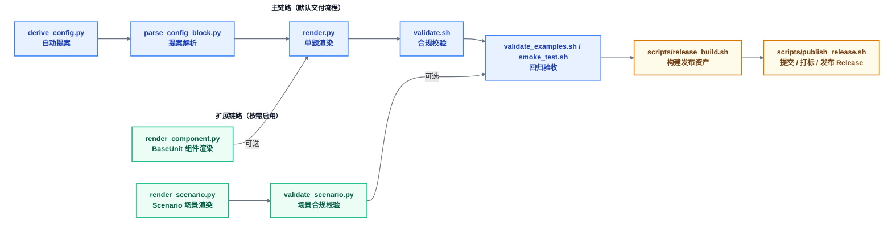

# CloverSec-CTF-Build-Dockerizer

<p align="center">
  <a href="README.md"><strong>简体中文</strong></a>
  <span> · </span>
  <a href="README.en.md"><strong>English</strong></a>
  <span> · </span>
  <a href="README.ja.md"><strong>日本語</strong></a>
</p>
<p align="center">
  
</p>
<p align="center">
  <a href="https://github.com/D1a0y1bb/CloverSec-CTF-Build-Dockerizer-skill/releases"></a>
  <a href="https://github.com/D1a0y1bb/CloverSec-CTF-Build-Dockerizer-skill"></a>
  <a href="https://github.com/D1a0y1bb/CloverSec-CTF-Build-Dockerizer-skill"></a>
</p>


<p align="center"><code><strong>VERSION</strong>: v2.2.0</code></p>

四叶草安全-创研中心竞赛 x Docker环境-专用容器构建 Skill。服务于竞赛、漏洞、基础镜像类的容器（题目）交付场景（CTF Jeopardy / Web / Pwn / AI / RDG / AWD / AWDP / SecOps / BaseUnit / Vulhub-like / Linux-QEMU），可通过 Agent 与 LLM 工具把题目附件、源码、指定目录转化为适配当前已验证竞赛平台与靶场交付约束的 Docker 镜像交付件，并通过自动化规则校验把构建质量稳定在可发布状态，减少人工试错与临场修补带来的不确定性。

如果你经历过赛前通宵补 Dockerfile、线上临时修 start.sh、打包后才发现平台契约不满足、客户临时需求改题目、收集漏洞题目镜像、转化外部仅有源码的历史CTF题目或CVE漏洞镜像，四叶草安全-创研中心竞赛 x Docker环境-专用容器构建 Skill 就是为这种场景而生的。让AI更高效更规范的去完成：安装、提案确认、单题渲染、场景编排、本地回归、发布打包。大幅度减少Agent工具自由发挥、浪费Token的行为、提高AI时代下的工作流质量对齐水平。

## V2.2.0 重大更新

v2.2.0 是 v2 系列能力整合版本，面向真实题目交付把 v2.0.3、v2.1.0、v2.1.1、v2.1.2 与 P1 迭代的主要成果合并到一个可验证入口。明确、低风险的 `challenge.yaml` 仍可直接渲染；混合输入、脏目录、高风险输入、compose/Vulhub-like、Linux-QEMU 缺资产和 cPanel/WHM 类输入会进入 proposal 确认流程。

本次重大更新覆盖：

1、交付场景：覆盖 Jeopardy/Web/Pwn/AI、RDG/AWD/AWDP/SecOps、BaseUnit、Scenario/Vulhub-like、Bundle/Recipe、Linux-QEMU。平台最终交付仍是单服务 `Dockerfile + start.sh + changeflag.sh`，Scenario/compose 只用于本地编排。

2、Linux-QEMU：Docker 外层保持 `/start.sh` 平台入口，容器内启动 QEMU guest，引导 vulnerable kernel、initrd/rootfs 和 guest 服务。默认使用 TCG，KVM 只作为显式可选加速；动态 flag 可通过 `debugfs` 写入 guest rootfs。完整 boot、flag 注入、PoC 复现归入 release/manual 验证。

3、工作流门槛：新增 `workflow.py` 和 `audit_input.py`，`derive_config.py` 输出 `input_audit`，mixed/dirty/high_risk 或 `gates=true` 默认要求 accepted proposal。确有人工确认时可用 `--manual --reason "..."`，原因会写入文本或 JSON 输出。

4、真实样例与回归：`validate_examples.sh` 默认只读，不再写回 `examples/`；Scenario 默认执行逐服务 `validate.sh`；`Build_test/` 升级为真实样例池，支持预期通过/预期失败匹配；Linux-QEMU release/manual 套件提供 preflight/static/build/boot/flag/full 分级检查。

5、Bundle、Compose 与 check-service：新增固定 Bundle Recipe 原型、compose/Vulhub-like 导入草案、HTTP/TCP/Redis/MySQL/SSH check-service 骨架生成。带 `CHECK_REVIEW_REQUIRED` 的检查脚本会被 `validate.sh` 阻断，直到人工确认检查逻辑。

6、结构化错误与发布检查：`render.py`、`validate_scenario.py`、`validate.sh` 支持 JSON/summary 输出；`release_build.py` 生成 release-status、SBOM 和依赖清单；`publish_release.sh` 正式发布默认执行 Docker smoke，跳过必须写原因。

7、Skill 使用体验：`SKILL.md` 改为短入口和按需读取索引，长说明迁入 `orchestrated_workflow.md`、`stack_cookbook.md`、`validation_guide.md`、`schema.md`、`troubleshooting.md` 等操作文档；迁移审计资料不进入发布包。

8、Golden snapshot 衡量：P1.8 前基线 `29d470e`，P1.8 后基线 `108977d`。`SKILL.md` 从 1089 行降到 206 行，入口减少约 81.1%；字节数从 39254 降到 10204，减少约 74.0%。OK 门槛、5 项确认、低风险 Node proposal/render/validate、Linux-QEMU 缺资产审计均无退化；Bundle partial 严格 digest 和 Scenario Vulhub-like 严格 digest 从失败变为通过。报告与原始输出保存在 `开发文档（不同步）/golden_snapshot_p18/REPORT.md` 和 `开发文档（不同步）/golden_snapshot_p18/summary.json`，该目录不进入发布包。

9、发布同步修复：SkillHub slug、行尾空格、README/CHANGELOG/版本号、Git 导出质量检查纳入发布前门禁，减少审核通过后同步失败的情况。

## 核心能力矩阵


```mermaid
flowchart LR
    subgraph Main["主链路（默认交付流程）"]
        direction LR
        A["derive_config.py\n自动提案"] --> B["parse_config_block.py\n提案解析"]
        B --> C["render.py\n单题渲染"]
        C --> D["validate.sh\n合规校验"]
        D --> E["validate_examples.sh / smoke_test.sh\n回归验收"]
    end

    subgraph Ext["扩展链路（按需启用）"]
        direction LR
        F["render_component.py\nBaseUnit 组件渲染"] -->|可选| C
        G["render_scenario.py\nScenario 场景渲染"] --> H["validate_scenario.py\n场景合规校验"]
        H -->|可选| E
    end

    E --> I["scripts/release_build.sh\n构建发布资产"]
    I --> J["scripts/publish_release.sh\n提交 / 打标 / 发布 Release"]

    %% ──────────────────────────────────────────────
    %%          优化后的配色与样式（2025-2026流行风）
    %% ──────────────────────────────────────────────
    classDef main fill:#e8f1ff,stroke:#3b82f6,stroke-width:2px,color:#1e40af,font-weight:bold
    classDef ext  fill:#ecfdf5,stroke:#10b981,stroke-width:2px,color:#065f46,font-weight:bold
    classDef rel  fill:#fffbeb,stroke:#d97706,stroke-width:2px,color:#713f12,font-weight:bold
    classDef title fill:none,stroke:none,color:#111827,font-size:15px,font-weight:600

    class A,B,C,D,E main
    class F,G,H ext
    class I,J rel

    class Main,Ext title

    %% 连接线微调（可选，根据渲染引擎支持程度）
    linkStyle default stroke:#6b7280,stroke-width:1.5px
```

### 主链路（按顺序执行）

| 阶段 | 入口 | 作用 | 产出 |
|---|---|---|---|
| 1. 自动提案 | `derive_config.py` | 推断栈、端口、启动命令、runtime/profile 信号 | `config_proposal` |
| 2. 提案解析 | `parse_config_block.py` | 把 `CONFIG PROPOSAL` 转成规范 `challenge.yaml` | 标准化配置 |
| 3. 单题渲染 | `render.py` | 生成平台交付物 | `Dockerfile` `start.sh` `changeflag.sh` `flag(可选)` |
| 4. 合规校验 | `validate.sh` | 执行平台契约与风险规则检查 | `ERROR/WARN/INFO` |
| 5. 回归验收 | `validate_examples.sh` / `smoke_test.sh` | 批量回归与构建级冒烟 | 回归汇总 / pass-fail |

### 扩展链路（按场景启用）

| 场景能力 | 入口 | 作用 | 产出 |
|---|---|---|---|
| BaseUnit 组件渲染 | `render_component.py` | 生成“组件 + 指定版本”最小单元 | 可直接 `docker build` 的目录 |
| Bundle/Recipe 渲染 | `render_bundle.py` | 生成固定组合的单容器多服务 Recipe | 标准交付目录 |
| Linux-QEMU 内核题渲染 | `render.py` | 生成 Docker 内 QEMU guest 启动环境 | 单镜像交付目录 |
| Scenario 场景渲染 | `render_scenario.py` | 渲染多服务本地编排 | 服务目录 + `docker-compose.yml` |
| Scenario 场景校验 | `validate_scenario.py` | 校验 mode/profile/端口/AWDP 补丁契约 | pass/fail |
| Release 打包与发布 | `scripts/release_build.sh` / `scripts/publish_release.sh` | 生成资产并发布 tag/release | zip/sbom/deps |

## Skills.sh 一键安装

先验证技能可发现，再执行安装：

```
npx -y skills add . --list
```

使用npx默认一键安装到通用agent目录下（.agents/)当前请根据你实际的需求选择安装到不同的项目或全局目录下）

```bash
npx skills add https://github.com/d1a0y1bb/cloversec-ctf-build-dockerizer-skill --skill CloverSec-CTF-Build-Dockerizer
```

安装后，建议先用示例目录做一次完整闭环，确认 Docker 与脚本依赖可用。

### Codex UI 展示策略

当前 Skill 在 Codex UI 中的展示信息由 `src/CloverSec-CTF-Build-Dockerizer/agents/openai.yaml` 控制，主要包括：

- `display_name`：技能卡片标题
- `short_description`：技能卡片副标题
- `brand_color`：卡片品牌色
- `default_prompt`：点击试用或直接调用时的默认提示词
- `allow_implicit_invocation`：允许模型在匹配场景下隐式触发该 Skill

当前默认提示词策略是：先让 Agent 自动探测技术栈与 `profile`，再生成合规的 `Dockerfile` / `start.sh` / `changeflag.sh`，最后执行 `validate` 并给出交付建议。这一层只影响 Codex UI 中“技能怎么展示、怎么起手”，不改变 `render.py`、`validate.sh`、`render_component.py`、`render_scenario.py` 的运行时逻辑。

如果后续你想调整 Codex 里的卡片标题、简介文案或试用提示词，优先改这里，而不是去改 `README` 正文：

```yaml
interface:
  display_name: "CloverSec CTF Build Dockerizer"
  short_description: "标准化题目容器交付、BaseUnit/Linux-QEMU 构建与 Scenario 编排"
  default_prompt: "Use $cloversec-ctf-build-dockerizer to处理当前题目目录，先自动探测技术栈与 profile，再生成合规的 Dockerfile/start.sh/changeflag.sh，并执行 validate 与交付建议。"
```

## 如何快速开始

### Agent-Orchestrated 流程（推荐）

标准提示词（建议直接复制）：

```text
请使用 CloverSec-CTF-Build-Dockerizer 处理当前题目目录。
先运行自动探测并输出 CONFIG PROPOSAL（含证据），
我确认后再生成 Dockerfile/start.sh/changeflag.sh 并执行 validate。
```

快捷业务提示词（懒人版）：

```text
当前 src 是我的 CTF 题目源码，请按平台交付规范构建完整容器并完成校验。
```

### 手动命令链

```bash
python3 src/CloverSec-CTF-Build-Dockerizer/scripts/derive_config.py --project-dir . --format json --pretty
python3 src/CloverSec-CTF-Build-Dockerizer/scripts/render.py --config challenge.yaml --output .
bash src/CloverSec-CTF-Build-Dockerizer/scripts/validate.sh Dockerfile start.sh challenge.yaml
```

### 运行时基座选择（PHP/Node/Java）

```bash
python3 src/CloverSec-CTF-Build-Dockerizer/scripts/render.py \
  --config challenge.yaml \
  --runtime-profile php74-apache \
  --output .
```

镜像优先级规则：`--base-image > --runtime-profile > challenge.base_image > infer/default`。

## 竞赛模式构建分类

### Jeopardy（Web / Pwn / AI）

适用：常规CTF竞赛的解题模式，默认 `profile=jeopardy`。

```bash
python3 src/CloverSec-CTF-Build-Dockerizer/scripts/render.py \
  --config src/CloverSec-CTF-Build-Dockerizer/examples/node-basic/challenge.yaml \
  --output /tmp/jeopardy-node

bash src/CloverSec-CTF-Build-Dockerizer/scripts/validate.sh \
  /tmp/jeopardy-node/Dockerfile \
  /tmp/jeopardy-node/start.sh \
  /tmp/jeopardy-node/challenge.yaml
```

### Linux-QEMU（Linux kernel CVE / LPE）

适用：需要指定 guest kernel、initrd/rootfs、内核模块或内核配置的 Linux kernel 漏洞题。典型形态是外层 Docker 负责平台交付，内层 QEMU guest 负责漏洞环境。

建议配置形态：

```yaml
challenge:
  name: kernel-cve-demo
  stack: linux-qemu
  profile: jeopardy
  base_image: debian:bookworm-slim
  workdir: /opt/kernel-qemu
  expose_ports: ["22"]
  start:
    mode: cmd
    cmd: "qemu-system-x86_64"
  vm:
    arch: x86_64
    accelerator: tcg
    memory: 768M
    cpus: 2
    kernel: vm/vmlinuz
    initrd: vm/initrd.img
    rootfs: vm/rootfs.ext4
    append: "console=ttyS0 root=/dev/vda rw"
    guest_forwards:
      - proto: tcp
        host_port: "22"
        guest_port: "22"
    guest_flag_path: /root/flag
    flag_injection: debugfs
    healthcheck_mode: ssh-banner
```

交付要求：

- `/start.sh` 前台执行 QEMU，并显式设置 `-m`、`-smp`、`-nographic`、网络与 `hostfwd`。
- 默认使用 TCG；KVM 只能作为显式可选项，平台不应自动使用 `--privileged`。
- `EXPOSE`、平台端口映射、QEMU `hostfwd` 三处要对应。
- `changeflag.sh` 如果只写 `/flag`，guest 内不会自动看到新 flag；内层 flag 路径需要单独写入 rootfs 或由 guest 启动脚本读取。
- PoC/EXP 不建议进入镜像，作为附件与题解资料管理。
- 大型 kernel/rootfs 示例不建议进入默认 CI，完整启动验证应在 release/manual 阶段执行。

Release/manual 验证入口：

```bash
bash scripts/linux_qemu_manual_check.sh --mode preflight --case-dir /path/to/linux-qemu/code
bash scripts/linux_qemu_manual_check.sh --mode boot --case-dir /path/to/linux-qemu/code --host-port 2222
```

详细分层、TCG/KVM 边界、动态 flag 写入和 PoC 证据记录见 `src/CloverSec-CTF-Build-Dockerizer/docs/linux_qemu_manual_validation.md`。

### RDG

适用：防守运维 + check_service 计分场景，通常使用 `stack=rdg`。

```bash
python3 src/CloverSec-CTF-Build-Dockerizer/scripts/render.py \
  --config src/CloverSec-CTF-Build-Dockerizer/examples/rdg-python-ssti-basic/challenge.yaml \
  --output /tmp/rdg-python

bash src/CloverSec-CTF-Build-Dockerizer/scripts/validate.sh \
  /tmp/rdg-python/Dockerfile \
  /tmp/rdg-python/start.sh \
  /tmp/rdg-python/challenge.yaml
```

可用 `generate_check_stub.py` 生成 HTTP/TCP/Redis/MySQL/SSH 的可编辑 check-service 骨架：

```bash
python3 src/CloverSec-CTF-Build-Dockerizer/scripts/generate_check_stub.py \
  --type http \
  --output /tmp/rdg-python/check/check.sh \
  --target-port 80 \
  --path /
```

生成脚本默认带 `CHECK_REVIEW_REQUIRED`，`validate.sh` 会阻断发布，直到人工确认并移除标记。

### AWD

适用：攻防混合赛，基于现有 Web/Pwn 栈叠加 `profile=awd` 与运维入口。

关键点：暂时不新增 `stack=awd`，而是现有 stack + `profile=awd`。

```bash
python3 src/CloverSec-CTF-Build-Dockerizer/scripts/render_scenario.py \
  --config src/CloverSec-CTF-Build-Dockerizer/examples/scenario-awd-basic/scenario.yaml \
  --output /tmp/scenario-awd

python3 src/CloverSec-CTF-Build-Dockerizer/scripts/validate_scenario.py \
  --output /tmp/scenario-awd
```

上面的命令只校验 scenario/compose 结构；如需同时调用 `validate.sh` 检查每个服务目录，可追加：

```bash
python3 src/CloverSec-CTF-Build-Dockerizer/scripts/validate_scenario.py \
  --output /tmp/scenario-awd \
  --validate-rendered
```

批量回归入口 `validate_examples.sh` 和 `smoke_test.sh` 默认会对 scenario 示例执行逐服务交付校验，也就是自动追加等价的 `--validate-rendered`。如只需要轻量结构校验，可设置 `SCENARIO_VALIDATE_RENDERED=0`。

### AWDP

适用：attack + fix双竞赛模式下的题目，选手需要提交补丁包后通过竞赛平台上传后自动执行。

固定补丁模式：

- `patch/src/`
- `patch/patch.sh`
- `patch_bundle.tar.gz`

```bash
python3 src/CloverSec-CTF-Build-Dockerizer/scripts/render.py \
  --config src/CloverSec-CTF-Build-Dockerizer/examples/node-awdp-basic/challenge.yaml \
  --output /tmp/awdp-node

bash src/CloverSec-CTF-Build-Dockerizer/scripts/validate.sh \
  /tmp/awdp-node/Dockerfile \
  /tmp/awdp-node/start.sh \
  /tmp/awdp-node/challenge.yaml
```

### SecOps

适用：安全运维与加固配置类题目。`stack=secops + profile=secops` 已经做了独立语义，不再混入 RDG。

```bash
python3 src/CloverSec-CTF-Build-Dockerizer/scripts/render.py \
  --config src/CloverSec-CTF-Build-Dockerizer/examples/secops-nginx-basic/challenge.yaml \
  --output /tmp/secops-nginx

bash src/CloverSec-CTF-Build-Dockerizer/scripts/validate.sh \
  /tmp/secops-nginx/Dockerfile \
  /tmp/secops-nginx/start.sh \
  /tmp/secops-nginx/challenge.yaml
```

### BaseUnit（指定版本服务包最小单元）

适用：快速生成某组件某版本的纯服务基座镜像，避免现场手工编译踩坑。首批组件：`mysql`、`redis`、`sshd`、`ttyd`、`apache`、`nginx`、`tomcat`、`php-fpm`、`vsftpd`、`weblogic`。

```bash
python3 src/CloverSec-CTF-Build-Dockerizer/scripts/render_component.py --list

python3 src/CloverSec-CTF-Build-Dockerizer/scripts/render_component.py \
  --component redis \
  --variant 7.2-alpine \
  --profile jeopardy \
  --output /tmp/baseunit-redis

bash src/CloverSec-CTF-Build-Dockerizer/scripts/validate.sh \
  /tmp/baseunit-redis/Dockerfile \
  /tmp/baseunit-redis/start.sh \
  /tmp/baseunit-redis/challenge.yaml
```

### Bundle / Recipe（固定组合老环境）

适用：少数固定组合的单容器多服务老环境。BaseUnit 是单组件，Scenario 是本地多服务编排，Bundle 是一个 Docker 镜像内的有限 Recipe。

```bash
python3 src/CloverSec-CTF-Build-Dockerizer/scripts/render_bundle.py \
  --recipe legacy-centos7-python39-mysql57-redis5 \
  --output /tmp/bundle-centos7

python3 src/CloverSec-CTF-Build-Dockerizer/scripts/validate_bundle.py \
  --bundle-dir /tmp/bundle-centos7
```

当前首批 Recipe 为 `legacy-centos7-python39-mysql57-redis5` 与 `tomcat85-jdk8-mysql57`，均为 `support_level=partial`。旧系统包源和 MySQL 5.7 安装方式可能需要人工处理，默认回归只要求 render 与静态契约校验。

### Vulhub-like（多服务漏洞环境迁移）

适用：把 Vulhub 风格的多服务场景迁移到本地 compose 编排 + 平台单服务交付。快速的完成历史CVE的本地靶场引擎的适配，`docker-compose.yml` 仅用于本地验证，平台交付仍是每个服务独立目录。

```bash
python3 src/CloverSec-CTF-Build-Dockerizer/scripts/render_scenario.py \
  --config src/CloverSec-CTF-Build-Dockerizer/examples/scenario-vulhub-like-basic/scenario.yaml \
  --output /tmp/scenario-vulhub-like

python3 src/CloverSec-CTF-Build-Dockerizer/scripts/validate_scenario.py \
  --output /tmp/scenario-vulhub-like
```

上面的命令只校验 scenario/compose 结构；如需同时调用 `validate.sh` 检查每个服务目录，可追加 `--validate-rendered`。批量回归入口默认会执行逐服务交付校验；设置 `SCENARIO_VALIDATE_RENDERED=0` 可恢复为仅检查 scenario/compose 结构。

已有 `docker-compose.yml` 的目录可先生成导入草案：

```bash
python3 src/CloverSec-CTF-Build-Dockerizer/scripts/import_compose.py \
  --compose path/to/docker-compose.yml \
  --output /tmp/compose-import \
  --scenario-name imported-scenario
```

该命令会同时生成完整 `scenario.draft.yaml`、可渲染子集 `scenario.renderable.yaml` 和 `import-report.json`。只有可渲染子集适合继续交给 `render_scenario.py`。

## 平台硬契约与边界

所有渲染产物必须满足：存在 `Dockerfile`。存在可执行 `start.sh`。存在可执行 `changeflag.sh`。容器内存在 `/bin/bash`。Dockerfile 声明 `EXPOSE`。`start.sh` 启动真实服务进程，禁止空转保活。

`flag` 规则：默认需要交付 `flag`。显式 `include_flag_artifact=false` 时，只能放行 `flag` 缺失，不能放行 `changeflag.sh` 缺失。

Scenario 边界：允许输出 `docker-compose.yml` 做本地编排。平台最终交付仍是单服务目录（`Dockerfile + start.sh + changeflag.sh`）。

## Workflow 演示案例

Prompt 触发


提案确认


错误闭环


自动产物


自动校验


硬约束检查


交付清单


## Build_test 真实样例池

`Build_test/` 存放真实 CTF 和漏洞环境样例，用来覆盖 `examples/` 不适合承担的历史目录、半成品交付、脏输入、Linux-QEMU 缺资产和控制面板类仿真场景。

样例池采用期望匹配规则：历史样例可以声明 `validate.sh` 预期失败，只要实际结果与 `Build_test/cases.yaml` 一致，回归就通过。这样可以保留真实问题样本，而不会把它们误写成可发布交付件。

```bash
python3 scripts/validate_build_test.py
python3 scripts/validate_build_test.py --format json
python3 scripts/validate_build_test.py --case cpanel-whm-authbypass-rce
```

详细样例清单、字段说明和当前限制见 `Build_test/README.md`。每个样例目录都有 `case_note.md`，记录来源、预期路径、支持等级、验证等级和契约期望。

## 文件目录索引

### 根目录（发布与入口）

| 文件/目录 | 作用 |
|---|---|
| `README.md` | 中文默认完整手册（主入口） |
| `README.en.md` | 英文完整手册 |
| `README.ja.md` | 日文完整手册 |
| `VERSION` | 当前发布版本号 |
| `CHANGELOG.md` | 版本变更历史 |
| `LICENSE` | 开源许可证 |
| `Build_test/` | 真实题目构建回归样例 |
| `dist/` | `release_build` 生成的发布资产 |

### `scripts/`（仓库级治理与发布）

| 文件 | 作用 |
|---|---|
| `scripts/doc_guard.py` | 文档一致性门禁主实现 |
| `scripts/doc_guard.sh` | 文档门禁 Shell 入口 |
| `scripts/release_build.py` | release 打包主实现 |
| `scripts/release_build.sh` | release 打包入口 |
| `scripts/publish_guard.py` | 发布前版本/白名单守卫 |
| `scripts/publish_release.sh` | commit + push + tag + release 编排 |
| `scripts/generate_sbom.py` | SBOM 生成主实现 |
| `scripts/generate_sbom.sh` | SBOM 入口 |
| `scripts/sync.py` | 私有仓到发布仓同步逻辑 |
| `scripts/sync.sh` | 同步入口 |

### `src/CloverSec-CTF-Build-Dockerizer/data`（规则与配置数据）

| 文件 | 作用 |
|---|---|
| `schema.md` | `challenge.yaml` 输入契约 |
| `scenario_schema.md` | `scenario.yaml` 输入契约 |
| `bundle_schema.md` / `bundle_recipes.yaml` | Bundle/Recipe 输入契约与固定组合定义 |
| `stacks.yaml` | 栈默认值与模板映射 |
| `profiles.yaml` | profile 默认行为定义 |
| `components.yaml` | BaseUnit 组件与版本变体 |
| `runtime_profiles.yaml` | 运行时档位定义（php/node/java） |
| `patterns.yaml` | 自动探测规则 |
| `validate_rules.yaml` | `validate.sh` 规则配置 |
| `validate_scenario_rules.yaml` | scenario 校验规则配置 |
| `base_image_allowlist.yaml` | 基础镜像白名单 |
| `README.md` | data 目录说明 |

### `src/CloverSec-CTF-Build-Dockerizer/scripts`（渲染/校验核心脚本）

| 文件 | 作用 |
|---|---|
| `derive_config.py` | 自动推断 challenge 配置 |
| `parse_config_block.py` | 解析 CONFIG PROPOSAL |
| `render.py` | 单题渲染入口 |
| `render_component.py` | BaseUnit 组件渲染入口 |
| `render_bundle.py` / `validate_bundle.py` | Bundle/Recipe 渲染与校验 |
| `import_compose.py` | compose/Vulhub-like 导入草案 |
| `generate_check_stub.py` | RDG/SecOps check-service 骨架生成 |
| `render_scenario.py` | 场景编排渲染入口 |
| `validate.sh` | 单题契约校验入口 |
| `validate_scenario.py` | 场景契约校验入口 |
| `validate_examples.sh` | examples 批量回归 |
| `smoke_test.sh` | 冒烟测试 |
| `validate_context.py` | challenge 上下文解析辅助 |
| `autofix.py` | 常见问题自动修复辅助 |
| `detect_stack.py` | 栈识别辅助 |
| `utils.py` | 公共工具函数 |
| `cleanup_test_containers.sh` | 测试容器清理 |
| `test_runtime_profiles.sh` | runtime profiles 回归 |
| `README.md` | scripts 目录说明 |

### `src/CloverSec-CTF-Build-Dockerizer/templates`（模板库）

| 路径 | 作用 |
|---|---|
| `templates/node|php|python|java|tomcat|lamp|pwn|ai/` | Jeopardy 栈模板 |
| `templates/rdg/` | RDG 专用模板 |
| `templates/secops/` | SecOps 专用模板 |
| `templates/baseunit/` | BaseUnit 通用模板 |
| `templates/linux-qemu/` | Linux kernel CVE/LPE 的 QEMU guest 模板 |
| `templates/snippets/` | defense/check/changeflag 等片段 |
| `templates/README.md` | 模板目录说明 |

### `src/CloverSec-CTF-Build-Dockerizer/examples`（示例与回归输入）

| 路径 | 作用 |
|---|---|
| `examples/*-basic` | 单题最小示例（node/php/python/...） |
| `examples/node-awdp-basic` | AWDP 单题补丁契约示例 |
| `examples/secops-*-basic` | SecOps 示例 |
| `examples/baseunit-*` | BaseUnit 示例 |
| `examples/bundle-*` | Bundle/Recipe 输入示例 |
| `examples/linux-qemu-basic` | Linux-QEMU 占位 VM 资产示例 |
| `examples/scenario-awd-basic` | AWD 场景示例 |
| `examples/scenario-awdp-basic` | AWDP 场景示例 |
| `examples/scenario-vulhub-like-basic` | Vulhub-like 迁移示例 |
| `examples/scenario-compose-import-basic` | compose 导入草案示例 |
| `examples/README.md` | 示例目录说明 |

### `src/CloverSec-CTF-Build-Dockerizer/docs`（设计文档）

| 文件 | 作用 |
|---|---|
| `architecture_overview.md` | 架构总览 |
| `platform_contract.md` | 平台硬契约说明 |
| `orchestrated_workflow.md` | CONFIG PROPOSAL、OK 门槛和 5 项确认协议 |
| `stack_cookbook.md` | 各栈构建建议 |
| `validation_guide.md` | 校验规则、check-service 门禁与发布前检查 |
| `directory_guide.md` | 目录设计说明 |
| `troubleshooting.md` | 常见故障排查 |
| `beginner_guide.md` | 新手入门流程 |

## FAQ 与常见排障

### Q1：为什么必须有 `/start.sh`、`/changeflag.sh`、`/bin/bash`？

这是凌虚竞赛平台&星图大靶场引擎的运行契约（实际上适配市面上任意一家的竞赛平台与靶场Docker启动引擎）。缺任一项都可能导致题目无法被平台正常启动或重置。

### Q2：为什么我设置了 `include_flag_artifact=false` 还报错？

这个开关只允许 `flag` 缺失，不允许 `changeflag.sh` 缺失。请检查渲染目录里 `changeflag.sh` 是否存在且可执行。

### Q3：AWD 和 SecOps 看起来很像，怎么选？

你要做攻防对抗，选“现有栈 + `profile=awd`”。你要做加固运维，选 `stack=secops + profile=secops`。

### Q4：AWDP 为什么不是直接 SSH 修题？

AWDP 的关键是“补丁提交与审计”，不是现场运维。选手通过 `patch/src + patch.sh + tar.gz` 提交修复，平台再自动应用。

### Q5：Vulhub-like 场景为什么不能直接拿 compose 当最终交付？

因为目标平台要求单服务交付目录。`scenario` 的 compose 只用于你本地联调与验证拓扑。

### Q6：`npx -y skills add . --list` 和 Release 资产有关系吗？

没有直接依赖。前者验证技能可发现，后者是版本归档分发。

## 维护、贡献与发布

发布前最小检查清单：

```bash
bash scripts/doc_guard.sh
bash src/CloverSec-CTF-Build-Dockerizer/scripts/validate_examples.sh
bash src/CloverSec-CTF-Build-Dockerizer/scripts/smoke_test.sh
npx -y skills add . --list
bash scripts/release_build.sh --with-smoke
```

正式发布：

```bash
bash scripts/publish_release.sh --version v2.2.0
```

如果遇到远端 tag/release 冲突或认证失败，应该停止发布流程并先处理阻塞，不要临时修改版本号绕过。

## License

本项目使用 [MIT License](LICENSE)，版权所属@D1a0y1bb.
