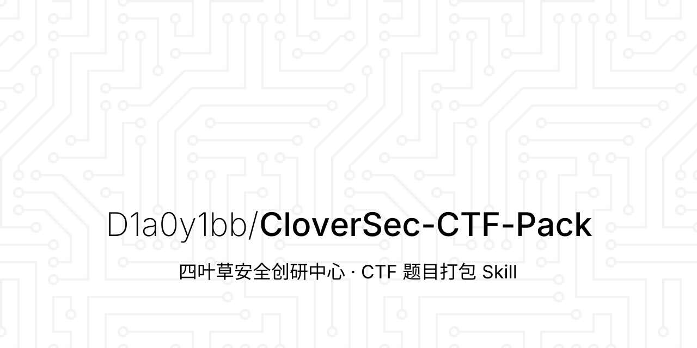

<p align="center">
  
</p>

<p align="center">
  <a href="https://github.com/D1a0y1bb/CloverSec-CTF-Pack/releases/latest"></a>
  <a href="LICENSE"></a>
  
</p>

<p align="center">
  <strong>简体中文</strong> · <a href="README.en.md">English</a>
</p>

<p align="center">
  <a href="#安装">安装</a> ·
  <a href="#使用">使用</a> ·
  <a href="#交付目录">交付目录</a> ·
  <a href="#手册">手册</a> ·
  <a href="#本地验证">本地验证</a> ·
  <a href="#flag-约定">Flag 约定</a> ·
  <a href="#仓库结构">仓库结构</a>
</p>

---

四叶草安全创研中心出题用的 Agent Skill。把题目源码、一段题目设计或者一个旧题目录交给 Claude Code / Codex，整理成能交付的题目包：容器题给出可构建的镜像目录并本地验证，附件题给出整理好的选手附件，两类都带手册。

- 交付目录按 `题目类型-题目名称` 命名，类型取 Web、Pwn、Crypto、AI 等 20 种。
- 源码、`Dockerfile`、`start.sh` 按内置范例编写，带中文注释，讲清漏洞点和不明显的配置。
- 容器题用 `verify.sh` 按平台的方式跑一遍：amd64 构建、`/start.sh` 启动、写入随机测试 Flag、探测端口，有 `solve/solve.py` 就运行它，必须拿到这个 Flag。
- 手册写在 `README/`，`solve/`、`附件/`、`镜像/` 都放在和 `src/` 同级的目录。
- 需要长期存档的题，按参考文档锁定镜像 digest、apt 源和依赖版本，上游更新后照样能 build。
- 多服务、Bundle、Scenario、RDG/AWD、Linux-QEMU 有单独的参考文档，常规题不加载。

## 安装

```bash
npx skills add D1a0y1bb/CloverSec-CTF-Pack -g -a claude-code -a codex
```

`-g` 装到用户目录 `~/.agents/skills/`，Claude Code 通过软链接读取；去掉 `-g` 装进当前项目。`-a` 指定装给哪些 Agent，可以写多个。

本机需要 Docker 和 `curl`。Apple Silicon 上按 amd64 构建会走模拟，比原生慢。

## 使用

在对话里点名 Skill，再给材料。Claude Code 用 `/cloversec-ctf-pack`，Codex 用 `$cloversec-ctf-pack`：

```text
/cloversec-ctf-pack 把 ./ssti-notes 做成平台题目。
Flask 写的 SSTI，flag 放 /flag，端口 5000。
```

材料可以是题目设计、只有源码的目录，或者带旧 Dockerfile 的历史题目。端口、启动命令、运行时版本、Flag 路径这类会卡住构建的信息如果缺了，它会一次问完，不会自己猜。

## 交付目录

容器题：

```text
Web-残影/
├── README/
│   ├── Web-残影.md       # 手册
│   └── assets/           # 手册里的截图
├── src/
│   ├── index.php
│   └── upload.php
├── Dockerfile
├── start.sh              # 平台入口，前台运行真实服务
├── challenge.yaml        # 端口、Flag 路径等平台字段
├── flag                  # 占位 Flag，平台启动后覆盖
├── solve/
│   └── solve.py          # 解题脚本，本地验证用，不进镜像
└── 附件/                 # 选手附件，需要时才有
```

纯附件题没有镜像相关文件，只有 `README/`、`src/`、`附件/`、`solve/`。`镜像/` 在需要导出镜像 tar 时才建。

## 手册

手册是交付的一部分，写在 `README/<题目类型-题目名称>.md`，截图放 `README/assets/`。章节顺序固定：题目名称、题目描述、题目难度、考察信息、旗帜信息、题目情况、部署方式、题目设计、解题步骤。骨架和写法见 [references/manual.md](src/CloverSec-CTF-Pack/references/manual.md)。

## 本地验证

```bash
bash ~/.agents/skills/cloversec-ctf-pack/scripts/verify.sh ./ssti-notes
```

脚本按 `linux/amd64` 构建镜像，用 `/start.sh` 起容器，等端口真正开始监听，往 `flag.path` 写一个随机测试 Flag，再探测端口。目录里有 `solve/solve.py` 时自动运行它（从环境变量 `HOST`、`PORT` 读地址），输出里出现这个测试 Flag 才算通过，能发现启动时把 Flag 缓存进变量的问题。其他语言的解题脚本用 `--solve '<命令>'` 指定。跑完删除容器和镜像，加 `--keep` 保留。

```text
== 构建镜像 (linux/amd64)
   完成，用时 16 秒
== 启动容器
   等待端口 5000 开始监听（最多 60 秒）
   容器运行中
== 写入测试 Flag 到 /flag
   回读一致（444 root:root）
== 探测端口 5000（本机 127.0.0.1:61197）
   HTTP 200
== 运行解题命令: python3 solve/solve.py
   拿到测试 Flag

== 结果: passed
```

| 结果 | 退出码 | 含义 |
|---|---|---|
| `passed` | 0 | 全部检查通过 |
| `partial` | 3 | 能跑，但有检查项没做（比如没声明端口），输出里逐条列出 |
| `failed` | 1 | 构建失败、容器退出、端口只监听 127.0.0.1、Flag 写不进去或解题拿不到 Flag |

端口和 Flag 路径默认从 `challenge.yaml` 读取，也可以用 `--port`、`--flag-path` 指定。完整参数见 `verify.sh --help`。

## Flag 约定

平台起容器后，直接把本场的动态 Flag 写进 `challenge.yaml` 中 `flag.path` 指向的文件。这个路径必须是程序实际读取的那个：

| 题型 | 常用路径 |
|---|---|
| Web / AI / Misc | `/flag` |
| Pwn | `/home/ctf/flag`（`root:ctf`，`440`） |
| PHP 嵌入 Flag | `/var/www/html/flag.php` |
| 数据库 | 在手册里写清更新 Flag 的 SQL |

程序要在每次请求时读取 Flag 文件。启动时读一次存进变量（Python 模块级变量、Java `static` 块），平台换了 Flag 也不会生效。

## 仓库结构

```text
src/CloverSec-CTF-Pack/
├── SKILL.md              # 入口：交付目录、流程、写法范例、注释要求、Flag 约定
├── agents/openai.yaml    # Codex 里显示的名称和默认提示词
├── references/
│   ├── platform.md       # 平台启动方式、环境变量传 Flag、镜像 tar 格式、challenge.yaml 字段
│   ├── dockerfiles.md    # 各语言 Dockerfile / start.sh 范例、Pwn、镜像版本固定
│   └── special.md        # 多服务、Bundle、Scenario、RDG/AWD、Linux-QEMU
└── scripts/
    └── verify.sh         # 本地构建与运行验证
```

版本记录见 [CHANGELOG.md](CHANGELOG.md)。

## License

[MIT](LICENSE)
