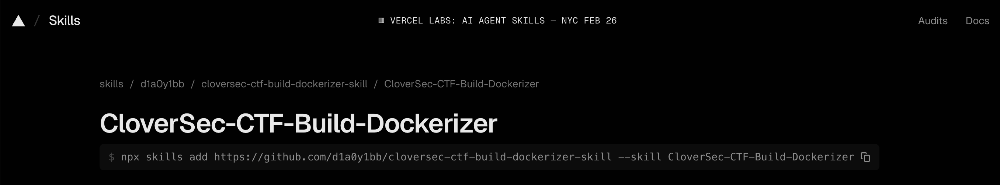
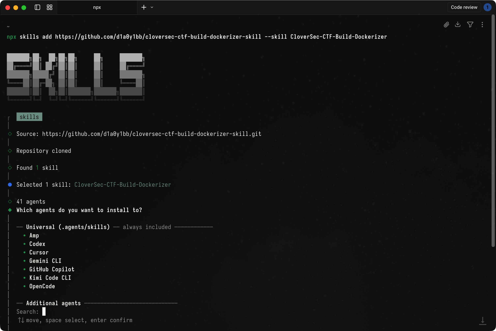
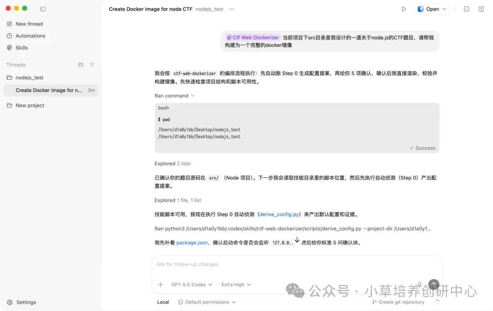
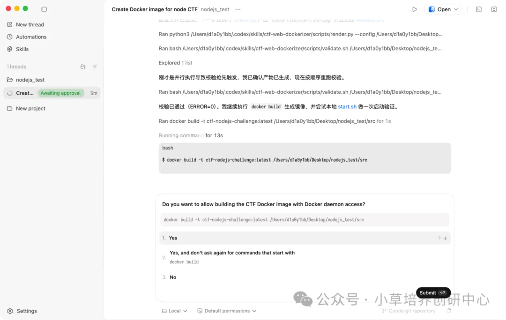
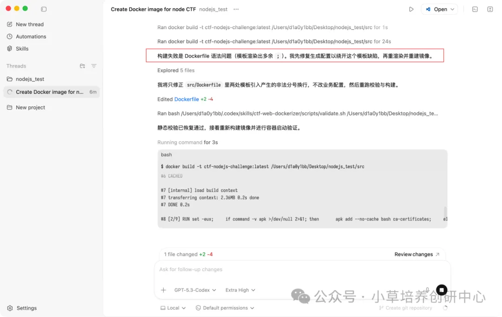
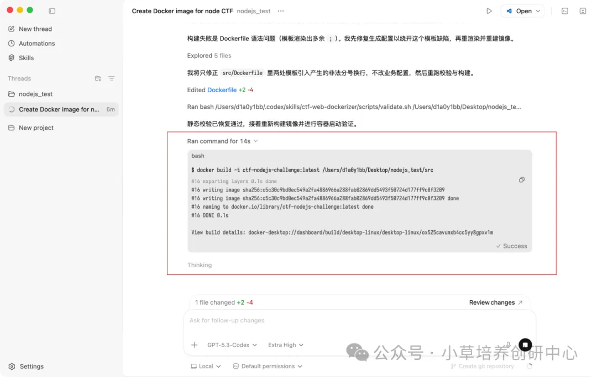
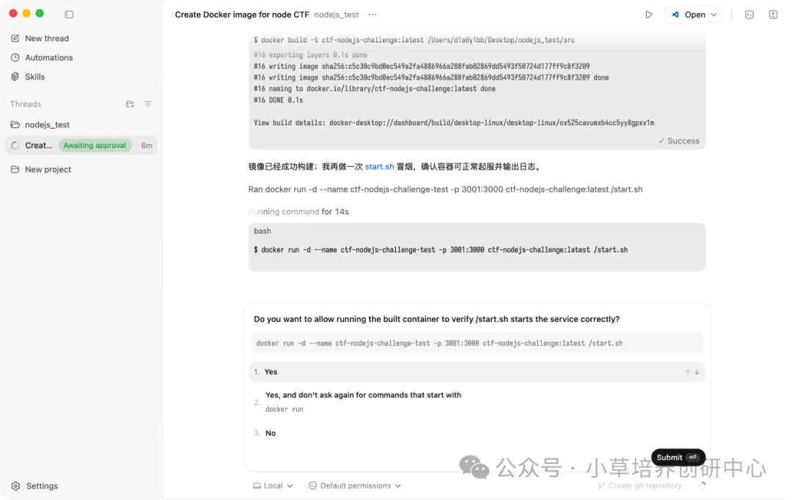
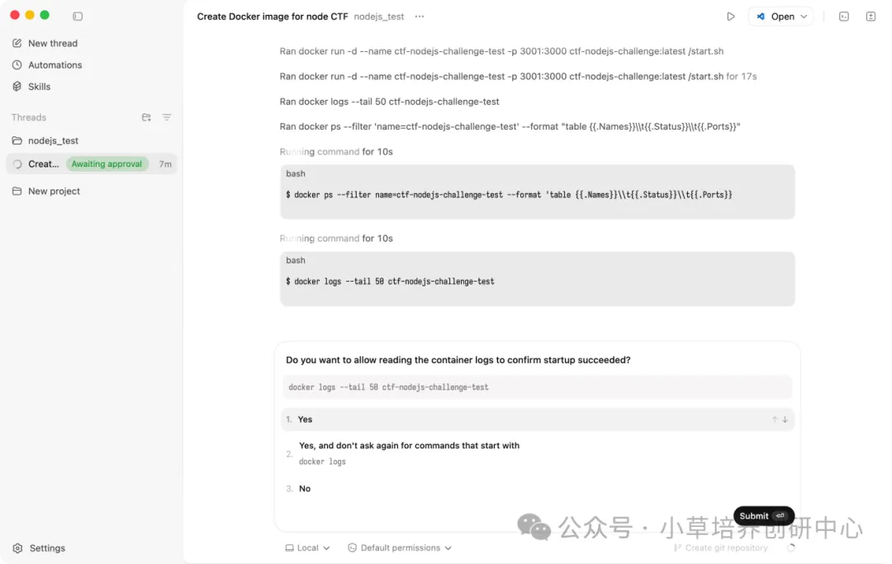
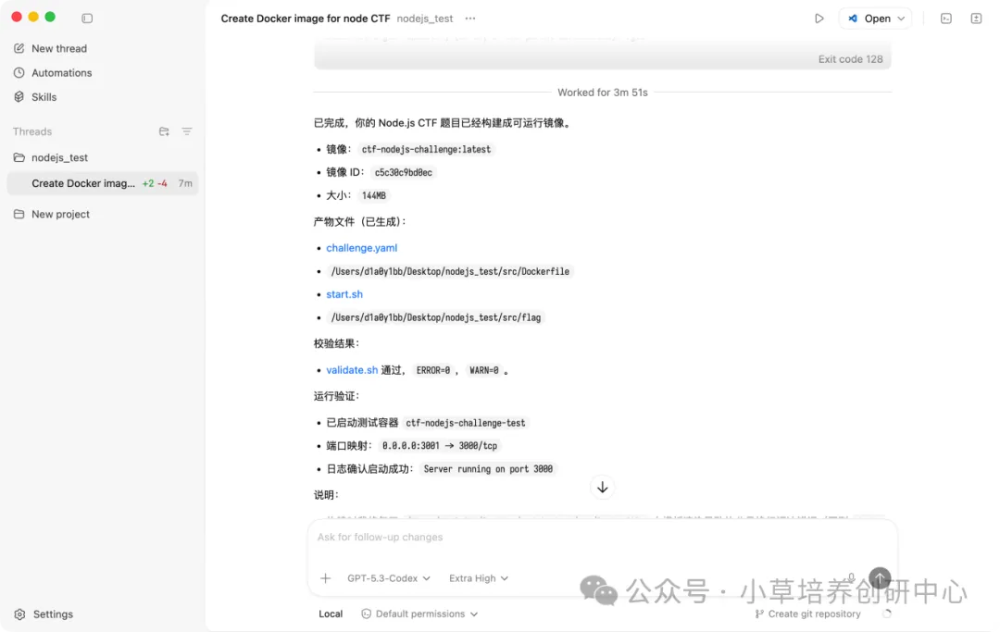

# CloverSec-CTF-Build-Dockerizer

[English](README.md)

[](https://github.com/D1a0y1bb/CloverSec-CTF-Build-Dockerizer-skill/releases)
[](https://github.com/D1a0y1bb/CloverSec-CTF-Build-Dockerizer-skill)
[](https://github.com/D1a0y1bb/CloverSec-CTF-Build-Dockerizer-skill)
[](https://github.com/D1a0y1bb/CloverSec-CTF-Build-Dockerizer-skill/releases/tag/v1.3.5)



四叶草安全-创研中心竞赛专用题目容器构建 Skill，服务于 CTF 容器题目交付场景（Web / Pwn / AI / RDG-Docker）。它将题目目录转化为平台可直接运行的交付件，并通过自动化规则校验把构建质量稳定在可发布状态，减少“人工试错 + 临场修补”带来的不确定性。

## What's New in v1.3.5

`v1.3.5` 将 RDG 从“兼容增强”升级为“防御修复题目可直接交付”的默认模式。RDG 模板默认具备 `ttyd + sshd` 双通道登录、`ctf/123456` 账户约定，以及 `check_service` 优先的判定语义。

本次把 `challenge.rdg` 扩展为完整可控模型：`enable_sshd`、`sshd_port`、`sshd_password_auth`、`ttyd_binary_relpath`、`ttyd_install_fallback`、`ctf_in_root_group`、`scoring_mode`、`include_flag_artifact`、`check_enabled`、`check_script_path`。渲染器、配置解析与校验器对这些字段统一收敛，保证 RDG 题目从自动探测到发版全链路一致。

<details>
<summary><b>v1.3.5 RDG 技术增强清单</b></summary>

本次强化了 `/ttyd` 交付约束：`enable_ttyd=true` 时必须落地 `/ttyd`（优先题目目录自带，缺失先做包管理安装回退，再做官方静态二进制下载回退，仍失败则阻断）。同时新增 sshd 初始化与启动链路，并把 RDG 校验从提示级提升为门禁级（ttyd/sshd/ctf/check-script）。`/flag` 在 RDG 中保持默认启用，但可通过 `include_flag_artifact=false` 显式关闭。

</details>

## RDG 回归样例

`src/CloverSec-CTF-Build-Dockerizer/examples` 新增两个 RDG 回归样例：

- `rdg-php-hardening-basic`（PHP 审计类题目形态）
- `rdg-python-ssti-basic`（Python SSTI 类题目形态）

两个样例均覆盖 `ttyd + sshd + check_service` 默认流程；其中 Python 样例额外覆盖 `include_flag_artifact=false` 的无 flag 判定路径。

### RDG 开关示例（运维型题目）

对于 WebLogic 运维题等“不需要选手登录容器”的场景，可以显式关闭双通道：

```yaml
challenge:
  stack: rdg
  rdg:
    enable_ttyd: false
    enable_sshd: false
    scoring_mode: check_service
    include_flag_artifact: false
    check_enabled: true
    check_script_path: "check/check.sh"
```

## 核心能力矩阵

| 能力 | 入口脚本 | 作用 | 输出/结果 |
|---|---|---|---|
| 自动探测 | `derive_config.py` | 识别栈、端口、启动命令候选 | `CONFIG PROPOSAL` 输入依据 |
| 配置解析 | `parse_config_block.py` | 把确认块转为 `challenge.yaml` | 标准化配置 |
| 渲染生成 | `render.py` | 生成 Docker 交付文件 | `Dockerfile` / `start.sh` / `flag(可选)` / `check/check.sh` |
| 静态校验 | `validate.sh` | 校验平台硬约束与规则 | ERROR/WARN/INFO |
| 样例回归 | `validate_examples.sh` | 批量验证示例目录 | 回归通过/失败清单 |
| 打包发布 | `release_build.sh` | 生成版本目录和 zip | `dist/...-vX.Y.Z.zip` |
| 一键发布 | `publish_release.sh` | commit/tag/release/上传资产 | GitHub Release 可下载包 |

## 一键安装

推荐使用 Codex 或 Trae 一键化安装，安装后即可在题目目录中调用该 Skill 执行自动探测与构建。



```bash
npx -y skills add https://github.com/D1a0y1bb/CloverSec-CTF-Build-Dockerizer-skill --skill cloversec-ctf-build-dockerizer --agent codex -y
```

如果需要先确认仓库可安装能力，可先执行：

```bash
npx -y skills add https://github.com/D1a0y1bb/CloverSec-CTF-Build-Dockerizer-skill --list
```

## 快速开始

### Agent 快速编排

```text
标准 Prompt：请使用 CloverSec-CTF-Build-Dockerizer 处理当前题目目录。先自动探测并输出 CONFIG PROPOSAL；我确认 OK 后，再生成 Dockerfile/start.sh/flag 并运行 validate。
```

这个流程的价值在于先确认配置、再生成产物，避免 AI 直接跳过关键约束。你也可以使用更短的业务表达式触发同样流程，例如：

```text
省事 Prompt：当前项目下 src 目录是我设计的一道关于 node.js 的 CTF 题目，请帮我构建为一个完整的 docker 镜像。
```

### 手动命令链

```bash
python3 src/CloverSec-CTF-Build-Dockerizer/scripts/derive_config.py --project-dir . --format json --pretty
python3 src/CloverSec-CTF-Build-Dockerizer/scripts/render.py --config challenge.yaml --output .
bash src/CloverSec-CTF-Build-Dockerizer/scripts/validate.sh Dockerfile start.sh challenge.yaml
```

## 自动化流程实录（本地化截图）

Prompt 驱动入口：



落地构建前的关键确认：



发现异常后的闭环处理：



生成交付文件并进入构建：



自动验收测试执行：



强制验收检查：



验收后交付清单：



## Build_test 真实样例

`Build_test` 目录包含 2 个由本 Skill 生成与校验的题目案例，可直接用于复现实战构建流程。

| Case Name | Stack | Exposed Port | Start Command | Core Files |
|---|---|---:|---|---|
| `CTF-NodeJs RCE-Test1` | `node` | `3000` | `node app.js` | `challenge.yaml` / `Dockerfile` / `start.sh` / `app.js` |
| `CTF-Python沙箱逃逸-Test2` | `python` | `5000` | `python app.py` | `challenge.yaml` / `Dockerfile` / `start.sh` / `题目源码 app.py` |

示例验证命令：

```bash
# Node 例子
cd "Build_test/CTF-NodeJs RCE-Test1"
npm ci
bash ../../src/CloverSec-CTF-Build-Dockerizer/scripts/validate.sh Dockerfile start.sh challenge.yaml

# Python 例子
cd "../CTF-Python沙箱逃逸-Test2"
bash ../../src/CloverSec-CTF-Build-Dockerizer/scripts/validate.sh Dockerfile start.sh challenge.yaml
```

示例构建与运行：

```bash
# Node
cd "Build_test/CTF-NodeJs RCE-Test1"
npm ci
docker build -t ctf-node-rce:latest .
docker run -d -p 13000:3000 ctf-node-rce:latest /start.sh

# Python
cd "../CTF-Python沙箱逃逸-Test2"
docker build -t ctf-python-sandbox:latest .
docker run -d -p 15000:5000 ctf-python-sandbox:latest /start.sh
```

<details>
<summary><b>Build_test 提交策略说明</b></summary>

`Build_test` 保留业务可复现所需文件（含题目源码与构建产物描述），但会移除阻塞协作的元数据（例如嵌套 `.git` 与 `.DS_Store`）。为控制仓库体积与评审噪音，`Build_test/**/node_modules/` 不再跟踪；需要本地运行 Node 样例时请先执行 `npm ci` 恢复依赖。

</details>

## 平台硬约束

交付镜像必须满足以下平台契约：平台固定通过 `/start.sh` 启动容器；镜像内必须可用 `/bin/bash`；`Dockerfile` 必须声明 `EXPOSE`；并且禁止使用 `sleep infinity` 这类空转保活方式。`/flag` 默认仍为硬约束，但 RDG 可在 `include_flag_artifact=false` 时显式放行（适配 check-service 判定）。

详细契约文档见：[platform_contract.md](src/CloverSec-CTF-Build-Dockerizer/docs/platform_contract.md)

## 支持栈矩阵

| Stack | 默认端口 | 启动示例 |
|---|---:|---|
| node | 3000 | `exec node server.js` |
| php | 80 | `exec apache2-foreground` |
| python | 5000 | `exec python app.py` / `exec gunicorn ...` |
| java | 8080 | `exec java -jar app.jar` |
| tomcat | 8080 | `exec catalina.sh run` |
| lamp | 80 | 数据库后台 + Apache 前台 |
| pwn | 10000 | `exec /usr/sbin/xinetd -dontfork` |
| ai | 5000 | `exec gunicorn ...` |
| rdg | 80 / 22 / 8022 | `exec apache2-foreground` / `exec python app.py` |

## 仓库结构

```text
.
├── Build_test/
│   ├── CTF-NodeJs RCE-Test1/
│   └── CTF-Python沙箱逃逸-Test2/
├── docs/assets/readme/
├── src/CloverSec-CTF-Build-Dockerizer/
│   ├── SKILL.md
│   ├── data/
│   ├── templates/
│   ├── scripts/
│   ├── examples/
│   └── docs/
├── scripts/
│   ├── sync.sh
│   ├── doc_guard.sh
│   ├── release_build.sh
│   └── publish_release.sh
├── CHANGELOG.md
└── VERSION
```

## 发布流程

```bash
# 标准打包
bash scripts/release_build.sh

# 一键发布（commit/tag/release/asset）
bash scripts/publish_release.sh --version v1.3.5
```

## 更新记录

版本迭代与变更细节见：[CHANGELOG.md](CHANGELOG.md)

## FAQ

### Q1：`Build_test` 的用途是什么？
`Build_test` 用于展示 Skill 的真实生成结果与可复现验收链路，便于团队在 PR 或交付前快速做回归验证。

### Q2：`npx skills add` 是否依赖 GitHub Release 附件？
不依赖。`npx skills add` 主要读取仓库内容，Release 附件用于版本归档与离线分发。

### Q3：为什么 `/start.sh`、`/flag`、`/bin/bash` 是硬性要求？
这些是平台运行契约的一部分。RDG 场景若使用 `check_service` 判定，可通过 `include_flag_artifact=false` 显式关闭 `/flag` 产物。

## 维护与贡献

建议在 PR / 合并前至少执行如下检查，确保文档、技能识别和发布产物链路没有回归：

```bash
npx -y skills add . --list
bash scripts/release_build.sh --skip-checks
```

维护团队：四叶草安全-网络安全人才培养与创新研究中心。

## License

This project is licensed under the [MIT License](LICENSE).
